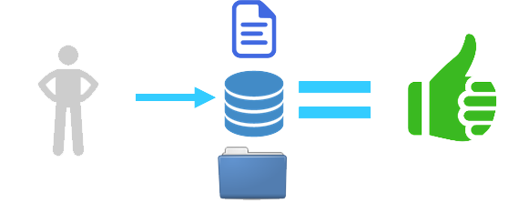
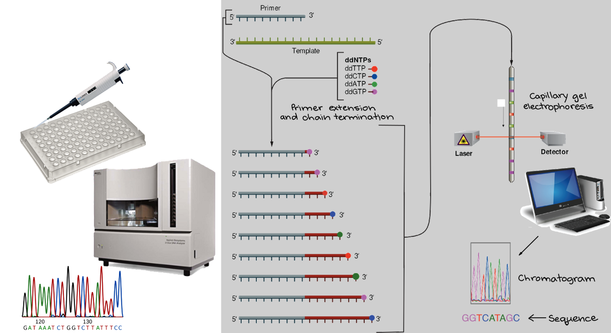
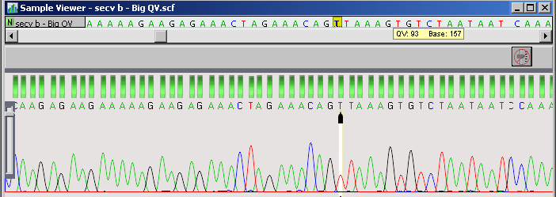
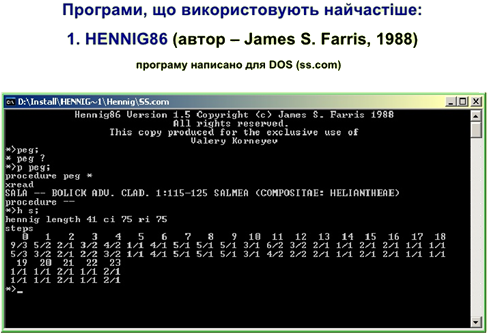

```{r load_packages, message=FALSE, warning=FALSE, include=FALSE} 
library(fontawesome)
```

```{r, load_refs, include=FALSE, cache=FALSE}

library(RefManageR)
RefManageR::BibOptions(
  check.entries = FALSE,
  style = "markdown",
  cite.style = "authoryear",
  bib.style = "authoryear"
)
referencias <- RefManageR::ReadBib("myBib.bib", check = FALSE)
```

```{r klippy, echo=FALSE, include=TRUE}
klippy::klippy()
library(tippy)
```

# Prêambulo{-}

A sistemática filogenética é atualmente um campo científico em plena expansão. As etapas de desenvolvimento dessas pesquisas envolvem a utilização de diversos programas de computadores, muitas vezes sem interface gráfica com usuário, inclusive de linguagens de programação. O tempo de aprendizagem desses programas pode variar dependendo do nível de conhecimento individual em informática. Nesse sentido, o presente curso poderá contribuir para a aceleração do processo de aprendizagem, ao mesmo tempo em que demonstra uma visão geral de todos os processos de uma análise filogenética com dados moleculares.

# Contextualizando

Por que / Para que contextualizar?

> *To change our future, we should change how we teach history to children*
>
> Yuval Noah Harari, 2022. Artigo publicado no *The Guardian*, na coluna *Opinion History*: [https://www.theguardian.com/commentisfree/2022/oct/18/change-future-teach-history-children](https://www.theguardian.com/commentisfree/2022/oct/18/change-future-teach-history-children)


## Histórico e fundamentos

A história da filoinformática insere-se na história da sistemática biológica pós-hennigiana da década de 50--60, isto é, a sistemática filogenética, e, evidentemente, surge após o desenvolvimento da informática, nessa mesma época.

::: {style="color: black; background: lightgray; text-align: justify; border: 5px outset lightgray; padding: 10px;"}

Para uma aprofundada análise da história da classificação biológica...

:::: {style="display: flex;"}

::: {}

{height="300px"}

:::

::: {}

{height="300px"}

:::

:::: 

**David L. Hull** (1935--2010)

[Obtuário publicado em *Biology and Philosophy* 25 (2010): 749–753](http://petergodfreysmith.com/wp-content/uploads/2013/06/David-Hull-Obit-PGS-20101.pdf)

**Systematics War**

- Taxonomia evolutiva [Gradismo]: Genealogia e similaridade adaptativa

- Taxonomia numérica [Fenética]: Similaridade total

  > We live in a world of stridently competing commercial messages,
pressed upon us in favor of one product or another. High-pressure
salesmanship and hyperbole are not restricted to the world of
business. In fact, "success in science depends not only on rational
argument but on a mixture of subterfuge, rhetoric, and propaganda"
(attributed to Feyerabend by Broad 1979).
  >
  > Moss, W.W., 1983. Taxa Taxonomists, and Taxonomy. *Numerical Taxonomy*, 72–75. [doi:10.1007/978-3-642-69024-2_8](doi:10.1007/978-3-642-69024-2_8)

  > **Taxonomists**. Taxonomists have always had the reputation of being
difficult. Intransigence may be rooted in the necessity of defending
prolonged self-immersion in a taxon that others find a total bore; it
is frustrating to have one's life work greeted with a yawn. Numerical
taxonomists have proved to be just as prickly as conventional
taxonomists, possibly more so because some of the brightest people in
systematics are involved in the current taxonomic battles. The
political maneuvering and character assassination that characterize
certain taxonomists today may not be atypical for science; they
certainly provide a fine example of its seamier side. If Feyerabend
is correct, it may be even a requirement of human nature that
scientific progress occur in this manner. Nevertheless, numerical
taxonomists are part of a larger community of systematic and evolutionary biologists, and of biology as a whole.
  >
  > Moss, W.W., 1983. Taxa Taxonomists, and Taxonomy. *Numerical Taxonomy*, 72–75. [doi:10.1007/978-3-642-69024-2_8](doi:10.1007/978-3-642-69024-2_8)

- Filogeneticistas [Cladística]: Genealogia


Não deixe de conferir o livro de Ernst Mayr: `Isto é biologia: a ciência do mundo vivo` para aprofundar os conhecimentos sobre a história da Biologia e das classificações biológicas.

:::: {style="display: flex;"}

::: {}

{height="300px"}

:::

::: {}

{height="300px"}

**Ernst W. Mayr** (1904--2005)

:::

:::: 


:::

<br>

O mundo experimentava uma grande revolução tecnocientífica que levou a uma nova episteme, o pós-modernismo. A pós-modernidade, no âmbito das tecnociências `r Cite(referencias, "Luz2014")`, foi caracterizada pelo surgimento da cibernética, informática, robótica, biologia molecular e a medicina nuclear, entre outras áreas de desenvolvimento tecnológico.

A gênese da informática insere-se na história do desenvolvimento do pensamento sistêmico e da lógica, e intrinsecamente correlacionada ao pensamento biológico contemporâneo. Suas raízes filosóficas, epistemológicas, podem ser buscadas na filosofia da linguagem e no positivismo lógico, cujos precursores pertenciam ao **Círculo de Viena**, que se dedicaram especialmente à **Filosofia da Ciência**.

O Círculo de Viena era composto por cientistas que, apesar de atuarem em várias áreas como física, economia, etc., buscaram resolver problemas sobre os fundamentos da ciência. Com as ideias desenvolvidas no Círculo de Viena, a Filosofia da Ciência passa a se ocupar especialmente acerca da analise do método e da linguagem das ciências. A filosofia passa a ser vista como necessária à análise lógica da linguagem e a descoberta de modos de redução das ambiguidades nas ciências.

O Círculo de Viena adotou uma forma de **empirismo indutivista**, fazendo uso de instrumentos analíticos, como a lógica e a matemática, para auxiliar na formulação dos enunciados científicos.

::: {style="color: black; background: lightgray; text-align: justify; border: 5px outset lightgray; padding: 10px;"}

Fonte para "Círculo de Viena":

- O Círculo de Viena e o início da Filosofia Contemporânea da Ciência: [https://brasilescola.uol.com.br/filosofia/o-circulo-viena-inicio-filosofia-contemporanea-ciencia.htm](https://brasilescola.uol.com.br/filosofia/o-circulo-viena-inicio-filosofia-contemporanea-ciencia.htm)

- Rodrigues, J.P., *sem data*. Neopositivismo – Círculo de Viena: [https://sublimefilosofia.com.br/neopositivismo-o-circulo-de-viena](https://sublimefilosofia.com.br/neopositivismo-o-circulo-de-viena).

:::

<br>

::: {style="color: black; background: lightgray; text-align: justify; border: 5px outset lightgray; padding: 10px;"}

:::: {style="display: flex;"}

::: {}


O **Círculo de Viena** foi o nome como ficou conhecido um grupo de filósofos que se juntou informalmente na **Universidade de Viena** de 1922 a 1936 com a coordenação de **Moritz Schlick**. Também foi chamado de "Sociedade Ernst Mach" em homenagem a **Ernst Mach** (*Stanford Encyclopedia of Philosophy*). Em reuniões semanais procuravam reconceitualizar o **Empirismo** a partir das novas descobertas científicas e demonstrar as fragilidades da Metafísica. Suas atividades cessam quando Schlick é assassinado por um fanático nazista em 1936 `r Cite(referencias, "wikiCirculoViena")`.

Seu sistema filosófico ficou conhecido como o "**Positivismo Lógico**", ou ainda, "**Empirismo Lógico**" ou "**Neopositivismo**" `r Cite(referencias, "wikiCirculoViena")`.


:::

::: {}

:::

:::: 

:::

<br>

A informática se desdobra no conhecimento humano a partir de uma racionalidade que se desenvolveu no século XX e que ficou conhecida como "visão sistêmica" ou "pensamento sistêmico", decorrente dos avanços teóricos especialmente nas áreas da biologia e filosofia da ciência.

**Organicismo -> Emergentismo -> Teoria Geral dos Sistemas -> Cibernética -> Informática**

Londres, década de 30. *The Theoretical Biology Club* --- esse era o nome que Joseph Needham dava às suas reuniões. O objetivo desse núcleo de cientistas (Ross G. Harrison, Joseph Needham, Paul Weiss, Joseph Woodger, John Haldane) era afastar o campo da metáfora da máquina (**mecanicismo -> fisicalismo**) e da metafísica do **vitalismo** para a filosofia empiricamente orientada da biologia organísmica (**organicismo**).


<br>

- **Ludwig von Bertalanffy** (1901--1972): precursor da Teoria Geral dos Sistemas.

:::: {style="display: flex;"}

::: {}

{width="300px"}

:::

::: {}

- Austríaco, biólogo
- "Pai do organicismo"?
- Tudo é parte de algum todo.

:::

::::

- **Norbert Wiener** (1894--1909): Cibernética

:::: {style="display: flex;"}

::: {}

{width="300px"}

:::

::: {}

- Americano
- Foi aluno de **`r tippy('Bertrand Russell', tooltip = '<a style="color: blue;">Bertrand Russell (1872–1970)</a><br>')`**.
- Em 1948, Wiener publicou o livro `Cibernética: ou Controle e Comunicação no Animal e na Máquina`:

  

:::

::::


- A cibernética é o estudo interdisciplinar da estrutura dos sistemas reguladores, suas estruturas, restrições e possibilidades. Norbert Wiener definiu a cibernética em 1948 como "o estudo científico do controle e comunicação no animal e na máquina" `r Cite(referencias, "wikiCibernetica")`.

- A cibernética é aplicável quando um sistema em análise incorpora um circuito fechado de sinalização --- originalmente chamado de relação "causal circular" --- isto é, onde a ação do sistema gera alguma mudança em seu ambiente e essa mudança é refletida no sistema de alguma maneira (*feedback*) que aciona uma alteração no sistema. A cibernética é relevante para, por exemplo, sistemas mecânicos, físicos, biológicos, cognitivos e sociais `r Cite(referencias, "wikiCibernetica")`.

- **Alan Turing** (1912--1954): Informática

:::: {style="display: flex;"}

::: {}

{width="300px"}

:::

::: {}

- Britânico, "pai da computação"
- Criou a "Máquina de Turing", protótipo dos computadores modernos.
- Desenvolveu um máquina para decifrar o código da "Máquina Enigma" (1918), utilizada pelos nazistas durante a Segunda Guerra Mundial.
- A cibernética desempenhou um papel decisivo no surgimento da revolução tecnológica.
- Foi aluno de John von Neumann (outro pioneiro da cibernética). Ambos e Claude Shannon, aluno de Norbert Wiener, com a sua Teoria da Informação, foram os precursores do computador `r Cite(referencias, "wikiCibernetica")`.
- Em 1943, constrói a primeira geração de computadores modernos (a válvula).

:::

::::

<br>

- O primeiro transistor foi criado com sucesso em 23 de dezembro de 1947, nos Laboratórios *Bell* em *Murray Hill*, Nova Jersey.
  
  - Hautsch, O., 2010. [O que é um transistor e porque ele é importante para o computador?](https://www.tecmundo.com.br/o-que-e/3596-o-que-e-um-transistor-e-porque-ele-e-importante-para-o-computador-.htm)

<br>

Por seu turno, a **Sistemática Filogenética** (cladística), postulada por **Willi Hennig**, foi originalmente concebida, mesmo que apenas em princípios, com a publicação de *Grundzüge einer Theorie der phylogenetischen Systematik*, em 1950.

- A intenção de Hennig era tornar a Sistemática uma ciência com métodos objetivos e reprodutíveis, afastando-a das hipóteses *ad hoc*, idiossincráticas. Por isso, ele desenvolveu não apenas um novo método, mas também ocupou-se de sua justificação teórica.

- Os sistemas de classificação devem refletir unicamente a genealogia.

- Reformou o conceito de "grupo natural", restringindo a sua definição, considerando como um grupo válido exclusivamente um grupo que contenha um ancestral e todos os seus descendentes.

  - Grupos válidos precisam compartilhar um ancestral comum exclusivo.

- Hennig era excepcionalmente preocupado com questões filosóficas `r Cite(referencias, "Tremblay2013")`.

  - Era muito comum na Alemanha do século XX os biólogos se ocuparem com questões filosóficas, principalmente como resultado da tendência interdisciplinar na cultura acadêmica naquela época.
  
  - Hennig estava extremamente comprometido com a dimensão ontológica e epistemológica do seu sistema filogenético.
  
  - Hennig tinha um interesse profundo em Filosofia, mas não era um filósofo de formação. Usou uma  abordagem eclética, buscando ideias em diferentes fontes `r Cite(referencias, "Schmitt2013")`.
  
    - Cursou apenas uma disciplina de Filosofia na Universidade.
    
    - Correspondências com sua esposa, amigos, dentre os quais, Klaus Günther.
    
:::: {style="display: flex;"}

::: {}

{height="300px"}

:::

::: {}

{height="300px"}

**Willi Hennig** (1913–1976)

:::

::::

- O trabalho de Hennig ficou mais conhecido somente com a publicação do livro *Phylogenetic Systematics*, em 1965, publicado em inglês, e quando suas ideias passaram a serem difundidas por outros taxonomistas:

  > O trabalho de Hennig está escrito em alemão bastante difícil, algumas frases sendo praticamente ininteligíveis. Em nenhum lugar se refere aos escritos de Huxley, Mayr, Rensch, Simpson e outros autores que cobriram em parte o mesmo terreno nas décadas anteriores. Novos termos e definições são introduzidos casualmente, mas não há um índice que guie a pessoa para as páginas relevantes. Não surpreendentemente, o volume foi inicialmente ignorado universalmente, exceto por alguns autores alemães. Não se tornou mais conhecido até 1965 e 1966, quando foram publicadas versões em inglês da metodologia de Hennig. Na década de 1970, um culto virtual de Hennig se desenvolveu, embora alguns de seus chamados seguidores tenham se afastado bastante dos princípios originais de Hennig.
  >
  >`r Cite(referencias, "Mayr1982")`

- Marco histórico da divulgação do programa de pesquisa Hennigiano foi a apresentação da tese de doutorado de Lars Brundin (1907--1993) no *4^th^ Nobel Symposium Current Problems of Lower Vertebrate Phylogeny*, realizado em 12--16 de junho de 1967.
  - Tese de Doutorado 1966: **Transantarctic Relationships and Their Significance, as Evidenced by Chironomid Midges, with a Monograph of the Subfamilies Podonominae and Aphroteniinae and the Austral Heptagyiae**.
  - Formalizou o método que ficou conhecido como **Biogeografia Filogenética** `r Citet(referencias, "Mattox2011")`.
  

  
- A tese de Brundin utilizando os método hennigiano chamou a atenção de **Gareth Nelson** (1937--), ictiologista, e grande difusor dos princípios da sistemática filogenética.


:::: {style="display: flex;"}

::: {}

{width="500px"}

:::

::: {}

Fotografia de Gareth Nelson (à dir.) junto a Lars Brundin (à esq.), tirada por Christopher Humphries em 1988, próximo ao Museu Sueco de História Natural em Estocolmo [publicada originalmente em Nelson (2000)] `r Citet(referencias, "Mattox2011")`.

:::

::::

- Gareth Nelson foi, sobretudo, um defensor do método.

  > Darwin's philosophy of classification is differently interpreted. Mayr (1974:120), for example, states "Evolutionary taxonomists have long been convinced that they strictly follow Darwinian principles of classification by giving equal consideration to branching and to phyletic change." By "evolutionary taxonomists," Mayr means those taxonomists who might agree with his philosophy of classification (e.g., Mayr, 1969). Mayr (1974:95) states, also: "The synthetic or evolutionary method of classification thus combines components of cladistics and of phenetics... The method in which cladistic and phenetic components are combined was originated by Darwin." I have elsewhere suggested that Darwin's philosophy of classification agrees better with Hennig (1950, 1966) than with Mayr (Nelson, 1971); the implication is that Mayr's "synthetic or evolutionary method of classification" is not of Darwinian but rather of Mayrian manufacture.
  >
  > Darwin-Henning Classification: A Reply to Ernst Mayr, `r Citet(referencias, "Nelson1974")`.

- Como a sistemática se tornou filogenética...

  > The furor engendered by the upstart arrival of Hennig's ideas has long since died down—and phylogenetic systematics is now the de facto order of the day. By the 1980s, recognizing that the essence of the analytic approach is the precise mapping of the distribution of characteristics in the attempt to separate relatively derived (advanced) from primitive features (and from "convergent" or "homoplastic" characters as well)—with groups to be defined and recognized solely on shared possession of "derived" features, algorithms that did the job on computers began to replace hand drawn cladograms on paper (whether napkins or otherwise).
  >
  >`r Citet(referencias, "Eldredge2010")`
  
- De grande importância é a edição especial sobre como ensinar filogenia da periódico científico [*Evolution: Education and Outreach*](https://link.springer.com/journal/12052/volumes-and-issues/3-4), editado por Daniel R. Brooks, em 2010.

- **A emergência da cladística hennigiana, foi revolução científica kuhnina ou não foi?**

  - Sim: `r Citet(referencias, "Terra2010")`
  
  - Não: `r Citet(referencias, c("Santos2008", "Santos_Klassa2012"))`

<br>


- Um dos primeiros esforços para estabelecer uma agenda para a sistemática biológica claramente definida ocorreu em meados da década de 70. Entretanto, não se tratava de uma iniciativa global `r Cite(referencias, "Eshbaugh")`.

  - O *workshop* realizado em 1974 no Missouri Botanical Garden, St. Louis, EUA, pode ser considerado um marco para a Filoinformática.
  
    - Nele, foram definidas tendências, prioridades e necessidades no campo da biologia sistemática e evolutiva. 
    
    - O evento foi financiado por pelo *Systematic Biology Program* da *Division of Biological and Medical Sciences* da agência governamental americana *National Science Foundation*. O encontro resultou na publicação do relatório: *Trends, Priorities, and Needs in Systematics and Evolutionary Biology* `r Cite(referencias, "TrendsandPriorities")`.
  
- Na década de 80, grandes avanços ocorrem na Sistemática Filogenética, com a publicação de importantes livros teórico-didáticos e o surgimento dos primeiros programas de computadores para realização de análises filogenéticas.


  
  - A filogenética fez a transição para uma estrutura baseada em probabilidade com o artigo *Evolutionary trees from DNA sequences: A maximum likelihood approach* de **Joseph Felsenstein** (1942--), publicado em 1981: `r Citet(referencias, "Felsenstein1981")`.
  
  - Este trabalho inovador lançou as bases para o campo emergente da filogenética estatística, fornecendo uma maneira tratável de encontrar estimativas de máxima probabilidade (ML) de árvores evolutivas a partir de dados de sequência de DNA `r Cite(referencias, c("Holland2013", "Posada2021"))`.

:::: {style="display: flex;"}

::: {}


:::

::: {}


Felsenstein (2004)

:::

::::

  - Importante teórico foi o paleoictiólogo **Collin Patterson** (1933--1998).
  
:::: {style="display: flex;"}

::: {}

{width="300px"}

:::

::: {}

{width="300px"}

Joysey & Friday (1982)

:::

::::

    
  - Um dos primeiros trabalhos que focaram no conceito de homologia.
      
    - Investiga a tradicional noção de homologia sob a nova luz da sistemática filogenética moderna (de Pinna, 2012).
      
    - "Homologia é sinapomorfia"
    
  - Conhecido por ter formulado o "teste de homologia" `r Cite(referencias, c("Holland2013", "Patterson1982"))`, basedo em três atributos:
    
    1. similaridade
      
      - topográfica [posicional], ontogenética, composicional
      
    2. conjunção
      
      - Uma homologia não pode coexistir em um mesmo organismo
        
        > "A homologia de braços humanos e asas de pássaros como membros anteriores de tetrápodes seria refutada pela existência de anjos com braços e asas"
         Imagem publicada em *On the Nature of Limbs: A Discourse*, de Richard Owen.
      
    3. congruência
      
      - Coerência de declarações de caráter (com outras homologias)
      
    - Paralelismo é uma falha no teste de congruência
      
    - Convergência é uma falha no teste de similaridade e congruência


- Já no início da década de 90, outra contribuição importante para a formulação do conceito filogenético (originalmente proposto por Hennig) de homologia foi postulado por **Mario de Pinna**, em 1991: *Concepts and tests of homology in the cladistic paradigm* `r Cite(referencias, "Pinna1991")`.


  
  - Ele propõe como justificativa para a equivalência entre homologia e sinapomorfia, corroborando e difundindo a ideia de que "homologia é sinapomorfia".
    
  - Veja também a importante revisão de "conceito de homologia" em `r Citet(referencias, "Brower2012")`.
  
    - Propôs os conceitos de **homologia primária** e **homologia secundária**.
    
    - Veja a emérita aula no Fórum de Sistemática e Evolução - USP, em 2012: https://www.youtube.com/watch?v=UmbFLVjnJs0
  
- A partir do início dos anos 90, sistematas começaram a se envolver cada vez mais na conservação e no papel desempenhado pela sistemática na solução de problemas da sociedade. O senso de urgência e um apelo à comunidade sistemática de biologia para definir claramente suas prioridades e agenda de pesquisa levaram a uma reunião de aproximadamente uma dúzia de pesquisadores, representando a *American Society of Plant Taxonomists*, a *Society of Systematic Biologists* e a *Willi Hennig Society* do *American Museum of Natural History*, em março de 1991. No início da reunião, reconheceu-se a necessidade de uma iniciativa abrangente para integrar os esforços em prol de objetivos comuns `r Cite(referencias, c("Cracraft", "Eshbaugh"))`.

- O marco teórico da filoinformática, isto é, o momento no qual os pressupostos gerais e conceitos específicos desse campo do conhecimento começaram a ser desenvolvidos, tem sido demarcado pela publicação da [*Systematics Agenda 2000*](https://archive.org/details/systematicsagend00syst), em 1994 `r Cite(referencias, "Cracraft")`.

 *Systematics Agenda 2000: Charting the Biosphere*. Publicada em 1994.

  - Três missões:

    1. Descobrir, descrever e inventariar a diversidade global de espécies.

    2. Analisar e sintetizar informações em um sistema de classificação preditivo que reflita a história da vida.

    3. Organizar informações em uma forma eficientemente recuperável de modo que atenda às necessidades da ciência e da sociedade.


## Bioinformática > Filoinformática

A bioinformática é um campo interdisciplinar que desenvolve métodos e ferramentas de software para a compreensão de dados biológicos, em particular quando os conjuntos de dados são grandes e complexos. Como um campo interdisciplinar da ciência, a bioinformática combina biologia, química, física, ciência da computação, engenharia da informação, matemática e estatística para analisar e interpretar os dados biológicos. A bioinformática tem sido utilizada para análises ***in silico*** de consultas biológicas utilizando técnicas computacionais e estatísticas `r Cite(referencias, "wikiBioinformatics")`.

A filoinformática é uma subárea da bioinformática (Bioinformática > Filoinformática).

## Passado

:::: {style="display: flex;"}

::: {}

{width="340px"}

:::

::: {}

- A rápida acumulação de dados e informações sobre a filogenia dos seres vivos  compeliu a comunidade científica do campo da Sistemática a buscar o estabelecimento de bases de dados filogenéticas `r Cite(referencias, "Sanderson")`

:::

:::: 


:::: {style="display: flex;"}

::: {}

{width="300px"}

:::

::: {}

- A emergência desse novo campo de pesquisa surgiu a partir da necessidade e dos esforços para alcançar a integração de dados sobre o conhecimento filogenético mantidos em bancos de dados isolados, independentes, e não-intercambiáveis `r Cite(referencias, "Yates")`

:::

::::


:::: {style="display: flex;"}

::: {}

{width="150px"}

:::

::: {}

- A filoinformática é uma empreitada interdisciplinar, liderada pela Informática e Biologia, mas também desenvolvida pela Matemática e Estatística.

:::

::::


:::: {style="display: flex;"}

::: {}

{width="62px"}

:::

::: {}

- Programas com **código fechado** e **preços muito elevados**.

:::

::::

## Presente

:::: {style="display: flex;"}

::: {}

{width="130px"}

:::

::: {}

- Em direção a **programas gratuitos** com **códigos abertos** e **dados livres**. ("*Data must be free*")

:::

:::: 


:::: {style="display: flex;"}

::: {}

<script type="text/javascript">

function swapImage(){
  if (document.getElementById("pic").src.endsWith('images/make_sense1.png') == true){
  
  document.getElementById("pic").src = "images/make_sense2.png";

  } else if (document.getElementById("pic").src.endsWith('images/make_sense2.png') == true){ 
  
  document.getElementById("pic").src = "images/make_sense1.png"; 
                
  }
  }
</script>



:::

::: {}

- "Informações disponíveis" fazem sentido para nós, mas não para os computadores.

:::

:::: 

(Clique na imagem acima)


:::: {style="display: flex;"}

::: {}

{width="90px"}

:::

::: {}

- A busca pela **integração** dos dados continua.

:::

:::: 


:::: {style="display: flex;"}

::: {}

{width="130px"}

:::

::: {}

- Busca pela **interoperabilidade**

:::

::::


## Futuro

- A próxima revolução do século XXI será dirigida pela Biologia & Informática.

> O **Dataísmo** declara que o universo consiste em fluxos de dados e que o valor de qualquer fenômeno ou entidade é determinada pela contribuição que dá para o processamento de dados
>
> Harari, Y.N. 2016. Homo deus: Uma Breve História do Amanhã


### Interoperabilidade

- A interoperabilidade pode ser entendida como uma característica que se refere à capacidade de diversos sistemas e organizações trabalharem em conjunto (interoperar) de modo a garantir que pessoas, organizações e sistemas computacionais interajam para trocar informações de maneira eficaz e eficiente `r Cite(referencias, "ePING")`.

- Nos sistemas de informações interoperáveis, ao invés de apenas documentos conectados... 


...temos uma arquitetura de dados como autores, bibliografias, documentos e outros objetos acessíveis em uma base que permite o processamento desses dados.

### Evolução da Web

A primeira versão da web --- Web 1.0 ---, também conhecida como **Web Sintática ou Web somente leitura**, é a era (1990-2000) em que o papel de um usuário é limitado à leitura de informações fornecidas pelos produtores de conteúdo. Não há opção para o usuário ou consumidor comunicar as informações aos produtores de conteúdo. Exemplo de Web 1.0 são sites estáticos e sites pessoais `r Cite(referencias, "WebEvolution")`.

A Web 2.0 também conhecida como **Web Social ou Web de leitura e escrita** é a era (2000-2010 e continua até agora) que facilita a interação entre os usuários da web e os sites internos que permitem que os usuários se comuniquem com outros usuários. Nesta era cada usuário pode ser um produtor de conteúdo e o conteúdo é distribuído e compartilhado entre os sites. Algumas das famosas aplicações Web 2.0 são Facebook, Youtube, Flickr, Twitter etc., As tecnologias web como HTML5, CSS3 e frameworks Javascript como ReactJs, AngularJs, VueJs etc. esta Rede Social. A Web 2.0 é construída em torno dos usuários, o produtor só precisa criar uma maneira de habilitá-los e envolvê-los `r Cite(referencias, "WebEvolution")`.

A Web 3.0 também conhecida como **Web Semântica ou leitura-gravação-execução** é a era (2010 e superior) que se refere ao futuro da web. Nesta era, os computadores podem interpretar informações como humanos por meio de Inteligência Artificial e Aprendizado de Máquina, que ajudam a gerar e distribuir de forma inteligente conteúdo útil adaptado a uma necessidade específica dos usuários `r Cite(referencias, "WebEvolution")`.


### O futuro integrativo da Sistemática


#### Padrão DarwinCore

Darwin Core Standard (DwC) é um padrão mantido pelo [*Darwin Core Maintenance Interest Group*](https://www.tdwg.org/community/dwc). Inclui um glossário de termos (em outros contextos, podem ser chamados de propriedades, elementos, campos, colunas, atributos ou conceitos) destinados a facilitar o compartilhamento de informações sobre diversidade biológica, fornecendo identificadores, rótulos e definições. O Darwin Core é baseado principalmente em taxa, sua ocorrência na natureza documentada por observações, espécimes, amostras e informações relacionadas.

[https://dwc.tdwg.org](https://dwc.tdwg.org/)

```{r echo=FALSE}
library(xaringanExtra)
embed_xaringan(
  url = "https://dwc.tdwg.org/",
  ratio = "4:2"
)
```


### W3C

{width="200px"}

- O [Consórcio da Rede Mundial Web (*World Wide Web Consortium* -- W3C)](https://www.w3.org/) é a principal organização de padronização da *World Wide Web*. 

  - Consiste em um consórcio internacional com 450 membros, agrega empresas, órgãos governamentais e organizações independentes com a finalidade de estabelecer padrões para a criação e a interpretação de conteúdos para a Web `r Cite(referencias, "wikiW3C")`.


O W3C foi fundado por Tim Berners-Lee em 1994 para levar a Web ao seu potencial máximo, por meio do desenvolvimento de protocolos comuns e fóruns abertos que promovam a sua evolução e assegurem a sua **interoperabilidade**. Sites desenvolvidos segundo esses padrões podem ser acessados e visualizados por qualquer pessoa ou tecnologia, independente dos hardware ou software utilizados, como celulares e **`r tippy("PDAs", tooltip = "<i>Personal digital assistants</i>")`**, de maneira rápida e compatível com os novos padrões e tecnologias que possam surgir com a evolução da internet `r Cite(referencias, "wikiW3C")`.

::: {style="color: black; background: lightgray; text-align: justify; border: 5px outset lightgray; padding: 10px;"}

Tim Berners-Lee é o criador da *World Wide Web*, tendo feito a primeira proposta para sua criação a 12 de março de 1989. Em 25 de dezembro de 1990, com a ajuda de Robert Cailliau e um jovem estudante do CERN, implementou a primeira comunicação bem-sucedida entre um cliente HTTP e o servidor através da internet `r Cite(referencias, "wikiTim")`.

Proposta de Berners-Lee onde a ideia da Web foi apresentada: [Information Management: A Proposal](https://cdsweb.cern.ch/record/1405411/files/ARCH-WWW-4-010.pdf)

Tim Berners-Lee também é o fundador da [*World Wide Web Foundation*](https://webfoundation.org). No aniverário de 30 anos da WWW, Tim Berners-Lee reflete sobre como a web transformou o nosso mundo e o que temos que fazer para construir uma web melhor para servir a humanidade: [30 years on, what’s next #ForTheWeb?](https://webfoundation.org/2019/03/web-birthday-30/)

:::


### *Web* Semântica (Web 3.0)

- O objetivo da *Web Semântica* é tornar os dados da Internet legíveis por máquinas. 

- Essa visão descreve uma teia de tecnologias vinculadas que englobam dados para permitir que as pessoas criem armazenamentos de dados online, construam vocabulários e escrevam regras para lidar com dados.

- A Web semântica é uma extensão da *World Wide Web* que permite aos computadores e humanos trabalharem em cooperação.

Ela interliga significados de palavras e, neste âmbito, tem como finalidade conseguir atribuir um significado (sentido) aos conteúdos publicados na Internet de modo que seja compreensível tanto pelo humano como pelo computador. A ideia da Web semântica surgiu em 2001, quando Tim Berners-Lee, James Hendler e Ora Lassila publicaram um artigo na revista *Scientific American*, intitulado: "Web Semântica: um novo formato de conteúdo para a Web que tem significado para computadores vai iniciar uma revolução de novas possibilidades" ([Berners-Lee et al. 2002](http://khabib.staff.ugm.ac.id/downloads/lecture/S3/The%20Semantic%20Web.pdf)).

::: {style="color: black; background: lightgray; text-align: justify; border: 5px outset lightgray; padding: 10px;"}

- Em discussões recentes sobre Web 3.0, a terminologia tornou-se intercambiável com o termo Web3 no contexto de criptografia, porém suas origens e contextos são diferenciados.

- A definição de Web 3.0 de Berners-Lee como Web Semântica é a ideia de que os dados da Internet são legíveis por máquina.

- O termo Web3 foi cunhado em 2014 pelo fundador da Polkadot e cofundador da Ethereum, Gavin Wood, refere-se a um ecossistema online descentralizado baseado em blockchain

- De acordo com Lemuel Park, cofundador e CTO da empresa de software BrightEdge, Foster City, Califórnia, a Web3 é simplesmente a evolução da Web 3.0. O conceito é impulsionado pela futura web descentralizada, concentrando-se na tecnologia blockchain, criptografia e criptomoedas. Isso inclui ainda tecnologias de AI que ajudam a prever tendências futuras e a aplicação de VR e AR e, agora, o metaverso.

- Blockchain e criptomoedas estão alimentando grande parte da tendência, especialmente porque o blockchain muda fundamentalmente o modelo de centralizado para descentralizado, e é uma tecnologia que tem transformado toda base da arquitetura da Web.

Fontes: 

[Why Web3 and Web 3.0 Are Not the Same](https://www.reworked.co/information-management/why-web3-and-web-30-are-not-the-same/)

[Web3 Vs Web 3.0: How Are They Different?](https://www.leewayhertz.com/web3-vs-web3-0/)

:::

### Sistemas de Organização do Conhecimento

Segundo a W3C, são considerados sistemas de organização do conhecimento:

- tesauros;
  - [Pinheiro & Ferrez, 2014. Tesauro Brasileiro de Ciência da Informação. Ministério da Ciência, Tecnologia e Inovação Instituto Brasileiro de Informação em Ciência e Tecnologia - ibict](https://www.gov.br/ibict/pt-br/central-de-conteudos/publicacoes/TESAUROCOMPLETOFINALCOMCAPA_24102014.pdf)

- esquemas de classificação;
- listas de assuntos;
- taxonomias;
- **ontologias**; e 
- outros tipos de vocabulários controlados

### Ontologias

Bases de dados estruturadas como redes ontológicas sobre a biodiversidade têm sido muito desenvolvidas nas áreas aplicadas tais quais a medicina, farmácia e agricultura (*OBO Foundry*, *Open Biological Ontologies*, *Gene Ontology*, *Planteome*, *Plant Ontology*).

::: {style="color: black; background: lightblue; text-align: justify; border: 5px outset lightgray; padding: 10px;"}

Há iniciativas nesse sentido na formação de novos taxonomistas e sistematas?

O uso de ontologias parece ser ainda incipiente.

:::

#### Fundamentos epistemológicos

- Gottlob Frege (1848--1925)

:::: {style="display: flex;"}

::: {}

{width="300px"}

:::

::: {}

- Alemão
- Um dos principais criadores da lógica matemática moderna
- O grande contributo de Frege para a lógica matemática foi a criação de um sistema de representação simbólica (Begriffsschrift, conceitografia ou ideografia) para representar formalmente a estrutura dos enunciados lógicos e suas relações, e a contribuição para a implementação do cálculo dos predicados `r Cite(referencias, "wikiFrege")`.

:::

::::

- Bertrand Russell (1872--1970)

:::: {style="display: flex;"}

::: {}

{width="300px"}

:::

::: {}

- Britânico

- Elaborou algumas das mais influentes teses filosóficas do século XX, e, com elas, ajudou a fomentar uma das suas tradições filosóficas, a assim chamada **Filosofia Analítica**.
  
  - Dentre essas teses, destacam-se a tese logicista, ou da lógica simbólica, de fundamentação da Matemática. Segundo Russell, todas as verdades matemáticas --- e não apenas as da aritmética, como pensava Frege --- poderiam ser deduzidas a partir de umas poucas verdades lógicas, e todos os conceitos matemáticos reduzidos a uns poucos conceitos lógicos primitivos.

- Concebeu a teoria das **descrições definidas**. A análise lógica precisa de frases declarativas contendo descrições definidas `r Cite(referencias, "wikiRussell")`.


:::

::::

Quine

`r Cite(referencias, "wikiInteroperabilidadeSemantica")`.

**interoperabilidade semântica**

#### *Web Ontology Language*

{width="100px"}

- **A W3C Web Ontology Language (OWL) é uma linguagem da Web Semântica projetada para representar conhecimento rico e complexo sobre coisas, grupos de coisas e relações entre coisas** `r Cite(referencias, "Yates")`..

- OWL é uma linguagem baseada em lógica computacional tal que o conhecimento expresso em OWL pode ser explorado por programas de computador, por exemplo, para verificar a consistência desse conhecimento ou tornar o conhecimento implícito explícito. Os documentos OWL, conhecidos como ontologias, podem ser publicados na World Wide Web e podem referir-se ou ser referidos a partir de outras ontologias OWL. OWL faz parte da pilha de tecnologia da Web Semântica do W3C, que inclui RDF, RDFS, SPARQL, etc `r Cite(referencias, "Yates")`.

Ontologias biológicas são **`r tippy("grafos acíclicos dirigidos", tooltip = "É um grafo dirigido sem ciclo; isto é, para qualquer vértice v, não há nenhuma ligação dirigida começando e acabando em v. Estes grafos aparecem em modelos onde não faz sentido que um vértice tenha uma ligação com si próprio.")`** de vocabulários controlados. Eles são projetados para capturar conceitos e descrições biológicas de uma maneira que possa ser facilmente categorizada e analisada com computadores.


#### *Resource Description Framework*

- O modelo de dados *Resource Description Framework* (RDF) é um modo de representação e de descrição de recursos que visa à interoperabilidade e o acesso à informação em ambientes digitais.

- O *RDF Schema* (*Resource Description Framework Schema* - RDFS) é um conjunto de classes com certas propriedades usando o modelo de dados de representação de conhecimento extensível RDF que fornece elementos básicos para a descrição de ontologias.

- Rede de conceitos

  - Conceitos conectados por sentenças (*statements*)

  - *Resource Description Framework* (RDF)
  
    - Tripla:
    
      - Sentença = Sujeito + predicado (ou propriedade) + objeto

Exemplo de uma sentença com dados filogenéticos:
        
- Sujeito: tree1
        
- Predicado: hasLikelihood
          
- Objeto: 2451.342


#### *Extensible Markup Language*

- A linguagem *Extensible Markup Language* (XML) é uma recomendação da W3C para gerar linguagens de marcação para necessidades especiais.

- É um dos subtipos da **SGML** (acrônimo de *Standard Generalized Markup Language* ou Linguagem Padronizada de Marcação Genérica) capaz de descrever diversos tipos de dados. Seu propósito principal é a facilidade de compartilhamento de informações por intermédio da internet `r Cite(referencias, "wikiXML")`.

  - O HTML e o XML derivam do SGML.

- A XML é uma tentativa de simplificar SGML para aplicações de aplicação geral, tais como a Web semântica.

Fonte: `r Citet(referencias, c("Souza_Alvarenga_2004", "Almeida_2002"))`.

#### OBO Foundry

A *Open Biological and Biomedical Ontologies Foundry* (*OBO Foundry*) é formada por um grupo de pessoas dedicadas a construir e manter ontologias relacionadas às ciências da vida. A *OBO Foundry* estabelece um conjunto de princípios para o desenvolvimento de ontologias para a criação de um conjunto de ontologias de referência interoperáveis no domínio biomédico. Atualmente, existem mais de uma centena de ontologias que seguem os princípios da OBO Foundry. Uma das mais difundidas é a *Gene Ontology* (GO), que descreve a função de genes. Existem também ontologias que descrevem fenótipos `r Cite(referencias, "wikiBioinformatics")`.

A maioria dos desenvolvedores de ontologias em OBO usa o formato *Web Ontology Language* (OWL) para construí-las.

#### Gene Ontology

A *Gene Ontology* (GO) é uma importante iniciativa de bioinformática para unificar a representação de genes e atributos de produtos gênicos em todas as espécies. Mais especificamente, o projeto visa:

1. Manter e desenvolver seu vocabulário controlado de genes e atributos de produtos gênicos;
2. Anotar genes e produtos gênicos e assimilar e disseminar dados de anotação; e
3. Fornecer ferramentas para facilitar o acesso a todos os aspectos dos dados fornecidos pelo projeto e permitir a interpretação funcional dos dados experimentais usando o GO, por exemplo, por meio de análise de enriquecimento.

A *Gene Ontology* foca na função dos genes e produtos gênicos. O GO também estende o esforço usando linguagem de marcação para tornar os dados (não apenas dos genes e seus produtos, mas também de atributos curados) legíveis por máquina, e fazê-lo de forma unificada em todas as espécies (enquanto as convenções de nomenclatura de genes variam de acordo com o táxon biológico) `r Cite(referencias, "wikiGO")`.

#### Plant Ontology

[https://archive.plantontology.org](https://archive.plantontology.org/)

Ancestrais ("pais") de:

- `nucellus` ([PO:0020020](http://purl.obolibrary.org/obo/PO_0020020))
- `pollen sac` ([PO:0025277](http://purl.obolibrary.org/obo/PO_0025277))

+ 

Descendentes ("filhos") de:

- `fruit` ([PO:0009001](http://purl.obolibrary.org/obo/PO_0009001)).

```{r echo=FALSE, message=FALSE, warning=FALSE}
library(ontologyIndex)
library(ontologyPlot)
library(dplyr)

PO <- get_ontology(
  
  "http://purl.obolibrary.org/obo/po.obo",
  propagate_relationships = "is_a",
  extract_tags = "everything",
  merge_equivalent_terms = TRUE
  
)

group <- get_ancestors(
  
  PO, 
  c(
    
    "PO:0020020", 
    "PO:0025277", 
    "PO:0009001",
    "PO:0030109",
    "PO:0030108",
    "PO:0030105",
    "PO:0030104",
    "PO:0030107",
    "PO:0030106",
    "PO:0030101",
    "PO:0030100",
    "PO:0030103",
    "PO:0030102",
    "PO:0030110",
    "PO:0030111",
    "PO:0030091",
    "PO:0030099",
    "PO:0030098"
    
  )
  
)

group.length <- length(group)
group.n <- 1:group.length


nodes.id <- group.n

nodes.label <- NULL
for(i in group.n){
  
  nodes.label.this <- PO$name[which(group[i] == PO$id)]
  nodes.label <- c(nodes.label, nodes.label.this)
  
}

nodes.title <- NULL
for(i in group.n){
  
  nodes.title.this <- PO$comment[which(group[i] == PO$id)]
  nodes.title <- c(nodes.title, nodes.title.this)
  
}

nodes <- data.frame(
  
  id = nodes.id,
  label = nodes.label,
  title = nodes.title
  
)


edges.is_a <- data.frame(
  
  from = names(PO$is_a),
  to = as.character(PO$is_a)
  
)

edges.is_a <- edges.is_a %>% dplyr::filter(from %in% group)

for(i in group.n){
  
  edges.is_a$from[i] <- which(edges.is_a$from[i] == rownames(nodes))
  
}

edges.is_a$to <- sub("BFO.*", "", edges.is_a$to)
  
for(i in group.n){
  
  if(length(which(edges.is_a$to[i] == rownames(nodes))) == 0){} else {
    
    edges.is_a$to[i] <- which(edges.is_a$to[i] == rownames(nodes))
    
  }
  
}


edges <- data.frame(
  
  from = edges.is_a$from, 
  to = edges.is_a$to,
  label = "is_a",
  arrows = "to"
  
)

graph <- visNetwork::visNetwork(nodes, edges)
graph

```

Ancestrais de:

- Esporângios:
  
  - `nucellus` ([PO:0020020](http://purl.obolibrary.org/obo/PO_0020020))
  - `pollen sac` ([PO:0025277](http://purl.obolibrary.org/obo/PO_0025277))

- Gametófitos:
  
  - `embryo sac` ([PO:0025074](http://purl.obolibrary.org/obo/PO_0025074))
  - `pollen` ([PO:0025281](http://purl.obolibrary.org/obo/PO_0025281))

```{r echo=FALSE, message=FALSE, warning=FALSE}
library(ontologyIndex)
library(ontologyPlot)
library(dplyr)

PO <- get_ontology(
  
  "http://purl.obolibrary.org/obo/po.obo",
  propagate_relationships = "is_a",
  extract_tags = "everything",
  merge_equivalent_terms = TRUE
  
)

group <- get_ancestors(
  
  PO, 
  c(
    
    "PO:0020020", 
    "PO:0025277", 
    "PO:0025074",
    "PO:0025281"
    
    
  )
  
)

group.length <- length(group)
group.n <- 1:group.length


nodes.id <- group.n

nodes.label <- NULL
for(i in group.n){
  
  nodes.label.this <- PO$name[which(group[i] == PO$id)]
  nodes.label <- c(nodes.label, nodes.label.this)
  
}

nodes.title <- NULL
for(i in group.n){
  
  nodes.title.this <- PO$comment[which(group[i] == PO$id)]
  nodes.title <- c(nodes.title, nodes.title.this)
  
}

nodes <- data.frame(
  
  id = nodes.id,
  label = nodes.label,
  title = nodes.title
  
)


edges.is_a <- data.frame(
  
  from = names(PO$is_a),
  to = as.character(PO$is_a)
  
)

edges.is_a <- edges.is_a %>% dplyr::filter(from %in% group)

for(i in group.n){
  
  edges.is_a$from[i] <- which(edges.is_a$from[i] == rownames(nodes))
  
}

edges.is_a$to <- sub("BFO.*", "", edges.is_a$to)
  
for(i in group.n){
  
  if(length(which(edges.is_a$to[i] == rownames(nodes))) == 0){} else {
    
    edges.is_a$to[i] <- which(edges.is_a$to[i] == rownames(nodes))
    
  }
  
}


edges <- data.frame(
  
  from = edges.is_a$from, 
  to = edges.is_a$to,
  label = "is_a",
  arrows = "to"
  
)

graph3 <- visNetwork::visNetwork(nodes, edges)
graph3

```

Descendentes de `vascular system` ([PO:0000034](http://purl.obolibrary.org/obo/PO_0000034))

```{r echo=FALSE, message=FALSE, warning=FALSE}

library(ontologyIndex)
library(ontologyPlot)
library(dplyr)

PO <- get_ontology(
  
  "http://purl.obolibrary.org/obo/po.obo",
  propagate_relationships = "is_a",
  extract_tags = "everything",
  merge_equivalent_terms = TRUE
  
)


group <- get_descendants(
  
  PO,
  c("PO:0000034")
  
)

group.length <- length(group)
group.n <- 1:group.length


nodes.id <- group.n

nodes.label <- NULL
for(i in group.n){
  
  nodes.label.this <- PO$name[which(group[i] == PO$id)]
  nodes.label <- c(nodes.label, nodes.label.this)
  
}

nodes.title <- NULL
for(i in group.n){
  
  nodes.title.this <- PO$comment[which(group[i] == PO$id)]
  nodes.title <- c(nodes.title, nodes.title.this)
  
}

nodes <- data.frame(
  
  id = nodes.id,
  label = nodes.label,
  title = nodes.title
  
)


edges.is_a <- data.frame(
  
  from = names(PO$is_a),
  to = as.character(PO$is_a)
  
)

edges.is_a <- edges.is_a %>% dplyr::filter(from %in% group)

for(i in group.n){
  
  edges.is_a$from[i] <- which(edges.is_a$from[i] == rownames(nodes))
  
}

edges.is_a$to <- sub("BFO.*", "", edges.is_a$to)

for(i in group.n){
  
  if(length(which(edges.is_a$to[i] == rownames(nodes))) == 0){} else {
    
    edges.is_a$to[i] <- which(edges.is_a$to[i] == rownames(nodes))
    
  }
  
}


edges <- data.frame(
  
  from = edges.is_a$from, 
  to = edges.is_a$to,
  label = "is_a",
  arrows = "to"
  
)

graph2 <- visNetwork::visNetwork(nodes, edges)
graph2

```

#### Planteome

[https://planteome.org](https://planteome.org)

Na nova era da biologia comparativa de plantas, analisa-se conjuntos de dados de vários experimentos de análise comparativa inter e intraespecíficos em projetos de transcriptoma, proteômica, fenômica e de anotação de genoma. Esses experimentos podem descrever, por exemplo, um conjunto de genes de uma ou mais espécies vegetais que são expressos diferencialmente em resposta a algum tipo de tratamento. Esses genes podem ter associações com fenótipos e funções moleculares, além de várias características de genes e proteínas. Para um pesquisador olhando para esses dados, o valor vem da análise desses dados. Infelizmente, os dados estão presentes em muitos locais em repositórios de dados online e também são anotados usando diferentes vocabulários e palavras-chave que muitas vezes não correspondem às descrições entre os diferentes recursos. O problema pode ser resolvido de duas maneiras:

1. manter os dados em locais diferentes, mas anotá-los com vocabulários de referência comuns (ontologias) que podem ser consultados em tempo real usando palavras de consulta comuns; e/ou

2. manter os dados em um local centralizado e resolva as descrições conflitantes adotando um único padrão. 

Considerando os recursos limitados e a enorme quantidade de dados distribuídos em muitos sites, o [projeto cROP](https://cropontology.org/) traz uma abordagem integrada de adoção de padrões comuns de anotação e um conjunto de ontologias de referência para Plantas.


# Filoinformática

## Conceito

- **Falta uma definição amplamente aceita**, mas qualquer conceito deve considerar as funções da informática de: coleta, classificação, tratamento, processamento, armazenamento, recuperação e integração, bem como a de apresentação e representação de dados.

::: {style="color: black; background: lightgray; text-align: justify; border: 5px outset lightgray; padding: 10px;"}
Campo que abrange todas as etapas, tarefas e usos de ferramentas computacionais envolvidas na produção do conhecimento filogenético, desde a obtenção ao tratamento, às análises e metanálises, armazenamento, recuperação, integração e representação de dados.
:::

## Fontes de dados

- Grande parte do desafio está no gerenciamento e interoperabilidade de bases de dados.

- Dados relacionado a estudos filogenéticos incluem:

  1.  nomenclatura;
  2.  taxonomias;
  3.  espécimes(*vouchers*);
  4.  distribuição espacial (geográfica);
  5.  dados abióticos;
  6.  matrizes de estados de caracteres;
  7.  descrições dos estados de caracteres;
  8.  sequências de ácidos nucleicos;
  9.  alinhamentos de sequências;
  10. árvores filogenéticas e metadados;
  11. genômica e proteômica;
  12. dados da biodiversidade;
  13. autores e referências bibliográficas.
  

## Perspectivas

- O poder preditivo da filoinformática instiga os biólogos à persuasiva busca pela descoberta de todos os ramos da Árvore da Vida, o mais rapidamente possível. A geração de uma base de dados única que interconecte informação filogenética às outras bases de dados sobre biodiversidade é a mais importante contribuição da Sistemática para a humanidade `r Cite(referencias, "Cracraft")`.

- Filoepidemiologia / Filodinâmica


[Forster, P., 2020. Phylogenetic network analysis of SARS-CoV-2 genomes](https://doi.org/10.1073/pnas.2004999117)

- O conhecimento filogenético é cada vez mais usado como uma ponte entre a genômica funcional, a evolução e o desenvolvimento --- desvendar como o genótipo se torna fenótipo exige que conheçamos a filogenia quase tão bem quanto conhecemos a genômica `r Cite(referencias, "Piel")`.

- Muitas das implicações do desenvolvimento dessa tecnologia ainda não foram sequer pensadas.


# Visão geral e roteiro do curso

Daremos um enfoque principalmente em dados moleculares, mas também utilizaremos dados morfológicos tanto para reconstrução filogenética quanto para mapeamento de caracteres nas árvores obtidas.

Quanto aos métodos de inferência filogenética, rodaremos análises de máxima verossimilhança e bayesiana. Não rodaremos análises de parsimônia, uma vez que o enfoque do curso será nos dados moleculares. Atualmente, há um senso comum de que ambas as análises, de máxima verossimilhança e bayesiana, são mais apropriadas do que a máxima parsimônia quando se tratam de dados moleculares (genotípicos). Não obstante, a análise de parsimônia continua a ser uma abordagem importante quando os dados são de natureza fenotípica (por exemplo, morfológicos).

Iniciaremos nossas atividades com a etapa de montagem de sequências, onde aprenderemos a montar uma sequência consenso a partir dos *primers* sequenciados.

Em seguida, realizaremos o alinhamento múltiplo e manual das sequências, onde construiremos a matriz com os dados moleculares.

Posteriormente, aprenderemos o básico sobre o terminal (ou console ou *shell*) do Windows - `MS-DOS`, conhecimentos que serão essenciais utilizar aplicativos com interface de linha de comando (CLI, em inglês) e para procederemos as análises filogenéticas.

As análises filogenéticas serão rodadas com dados moleculares, morfológicos, e a análise combinada, incluindo ambos. Utilizaremos os programas `IQ-TREE` para máxima verossimilhança e o `MrBayes` para bayesiana.

Então, aprenderemos o básico sobre o `r fa("r-project", fill = "steelblue")` para apresentarmos os principais pacotes desenvolvidos para análises filogenéticas e afins. Uma grande atenção será dada à edição de árvores filogenéticas através de três pacotes (`ape`, `phytools`, `ggtree`).

Logo, aprenderemos a executar estimações do estado ancestral com dados contínuos e discretos utilizando o pacote `phytools`.

Também executaremos uma análise de diversificação utilizando o programa `BAMMtools` para investigar mudanças nos regimes de diversificação.

Finalmente, conheceremos o programa `Biodiverse GUI`, que realiza diversos tipos de análises que incluem a conjunção de árvore filogenética e coordenadas geográficas dos terminais, dentre as quais inclui-se a métrica de diversidade filogenética.


# Técnicas moleculares

- Extração do DNA
- Amplificação
- Eletroforese
- Sequenciamento


## Extração do DNA

- O protocolo de extração de DNA é a primeira etapa do laboratório de análise molecular.

- O "protocolo CTAB" solução tampão CTAB `r Cite(referencias, "Doyles1987")`.

  - Maceração

    - Colocar 20--30 mg de material desidratado em sílica em microtubo (*eppendorf*) de 2 ml e 8--10 esferas de aço (2 mm)
    
    {width="100px"}
  
    - Macerar no *Mini-Beadbeater* (BioSpec)
    {width="500px"}
  
- Adição do tampão CTAB

{width="300px"}

- Centrifugar

{width="300px"}

- Lavar o *pellet*

{width="200px"}

:::: {style="display: flex;"}

::: {}

{width="200px"}

:::

::: {}

- Etapa de pré-lavagem com sorbitol para materiais herborizados `r Cite(referencias, "Inglis")`

:::

:::: 


## Amplificação

- A Reação em cadeia da polimerase (*Polymerase Chain Reaction* - PCR) é um procedimento para clonagem molecular.


- Enzimas de restrição (tesouras moleculares)

  - Reconhecem e clivam diferentes sítios de restrição.

- Primers (DNAs iniciadores)

- Enzima DNA polimerase

  - Faz a replicação do DNA.


## Eletroforese

- Técnica usada para separar fragmentos de DNA de acordo com seu tamanho.

- As amostras são colocadas nos poços localizados em uma das extremidades de um gel de agarose, e uma corrente elétrica é aplicada para que as amostras avancem pelo gel.

- Quando um gel é pigmentado com um corante que se liga ao DNA, os fragmentos de DNA podem ser vistos como bandas. Cada banda representa um grupo de fragmentos de DNA de mesmo tamanho.


{width="400px"}

- Para a visualização se utiliza a luz UV de um transiluminador.


A concentração da amostra é crucial para o sucesso da reação de sequencimento. Usar muito pouco DNA é um erro que leva a nenhum sinal ou a sinais fracos, mas usar muito é um erro também!


## Sequenciamento

### História do sequenciamento didesoxi Sanger

O sequenciador ABI utiliza o método de sequenciamento tradicional, proposto por Frederick e Sanger na década de 70, para gerar sequências entre 300 e 850pb. Na reação de sequenciamento são utilizados, além dos nucleotídeos comuns, nucleotídeos modificados e marcados com fluorescência, chamados dideoxirribonucleotídeos. Cada nucleotídeo (A, C, G, T) é marcado com um fluoróforo distinto. Durante a reação de extensão do fragmento de DNA, quando um nucleotídeo modificado é incorporado ao fragmento, o que ocorre de forma aleatória, a reação é interrompida. Os fragmentos de DNA gerados serão, portanto, de tamanhos diversos. Depois de separados por eletroforese capilar, uma câmera CCD (detector) acoplada ao equipamento irá identificar a fluorescência emitida pelo nucleotídeo marcado e assim caracterizá-lo (https://www.einstein.br/pesquisa/pesquisa-experimental/plataformas/plataforma-sequenciamento).



- Os princípios de replicação do DNA foram usados por Sanger et al. no desenvolvimento do processo agora conhecido como sequenciamento didesoxi Sanger.

- Esse processo aproveita a capacidade da DNA polimerase de incorporar 2',3'-didesoxinucleotídeos -- análogos de bases nucleotídicas que não possuem o grupo 3'-hidroxila essencial na formação da ligação fosfodiéster ([DNA Sequencing by Capillary Electrophoresis 3ed](https://www.ramaciotti.unsw.edu.au/sites/default/files/2019-04/sequencing_handbook_FLR.pdf)).

- O sequenciamento de didesoxi Sanger requer um molde de DNA, um *primer* de sequenciamento, DNA polimerase, desoxinucleotídeos (dNTPs), didesoxinucleotídeos (ddNTPs) e tampão de reação.

- Quatro reações separadas são configuradas, cada uma contendo nucleotídeos marcados radioativamente e ddA, ddC, ddG ou ddT.

- As etapas de anelamento, rotulagem e terminação são realizadas em blocos térmicos separados.

  - A síntese de DNA é realizada a 37°C, a temperatura na qual a DNA polimerase tem a atividade enzimática ideal.
  - A DNA polimerase adiciona um desoxinucleotídeo ou o correspondente 2',3'-didesoxinucleotídeo em cada etapa da extensão da cadeia.
  - A adição de um desoxinucleotídeo ou um didesoxinucleotídeo depende da concentração relativa de ambas as moléculas. Quando um desoxinucleotídeo (A, C, G ou T) é adicionado à extremidade 3', a extensão da cadeia pode continuar. No entanto, quando um didesoxinucleotídeo (ddA, ddC, ddG ou ddT) é adicionado à extremidade 3', a extensão da cadeia termina. O sequenciamento dideoxy Sanger resulta na formação de produtos de extensão de vários comprimentos terminados com dideoxynucleotídeos no final de 3'.

O sequenciador ABI (*Applied Biosystems*) é um instrumento baseado em laser que utiliza marcadores fluorescentes para analisar os produtos de uma reação de sequenciamento à medida que migram através de um gel. Depois que os dados são coletados a partir de uma execução de sequenciamento, o programa *Analysis* da *Applied Biosystems* identifica e rastreia os rastros (*traces*) de amostra do gel e, subsequentemente, normaliza e integra os dados brutos (*raw data*) em um cromatograma da sequência final.

Bases ambíguas tendem a ocorrer perto do final da sequência e podem ser editados ou excluídos pelo usuário antes de exportar os dados para outras comparações ou alinhamentos `r Cite(referencias, "Hagemann1999")`.

# Montagem de sequências

A primeira etapa computacional de uma análise filogenética é a montagem das sequências (*sequence assembly*) de cada um dos terminais a partir dos cromatogramas de cada *primer* sequenciado.

## Cromatogramas


### Conceito

- Rastro (*trace*) do sinal dos nucleotídeos marcados por corante de acordo com a intensidade, indicada por quatro cores correspondentes às quatro bases nitrogenadas.

### Finalidade

- Verificar a qualidade do sinal
- Detecção dos picos

A baixa qualidade do sinal é denominado de ruído (*noise*). O ruído é caracterizado por picos pouco acentuados, com altura mais baixa e mais largos.


### Qualidade do sinal

- Alta
  - Sem ambiguidade
  - Picos adequadamente distantes com espaços regulares
  - Sem ruído
  - 

- Média
  - Algumas ambiguidades
  - Picos adequadamente distantes com espaços regulares
  - Alguns trechos homopoliméricos não estão bem resolvidos
  - 

- Baixa
  - Algumas ambiguidades
  - 
  - 

Fonte: [DNA Baser - What are chromatograms?](https://www.dnabaser.com/help/samples/what%20is%20a%20chromatogram.html)

### Arquivo .ab1

O arquivo `.ab1` contém o eletroferograma da sequência de DNA, bem como dados brutos e outras informações.

O arquivo `.ab1` são gerados pelos sequenciadores da *Applied Biosystems*. Outros sequenciadores utilizam arquivos nos formatos `.scf` (*Standard Chromatogram Format*) e `.ztr`.

Dois programas foram desenvolvidos especialmente para visualizar os cromatogramas:

- [Chromas](http://technelysium.com.au/wp/chromas)
- [FinchTV](https://finchtv.software.informer.com/1.4)

... mas diversos programas podem realizar a tarefa.

### Software FitchTV

:::: {style="display: flex;"}

::: {}

{width="300px"}

:::

::: {}

O [FinchTV 1.4](https://finchtv.software.informer.com/a duração dessa etapa é variável1.4) é um programa *open-source* para visualização da qualidade e intensidade dos sinais obtidos. Com ele, é possível analisar os dados brutos do cromatograma (*raw data*).

:::

:::: 


### Manual do sequenciamento Sanger

Diversos fatores podem resultar em baixa resolução do sinal. Observe o capítulo 8 (*Troubleshooting*) do guia da *Applied Biosystems* para entender alguns dos principais problemas no sequenciamento: 

[DNA Sequencing by Capillary Electrophoresis 3ed](https://www.ramaciotti.unsw.edu.au/sites/default/files/2019-04/sequencing_handbook_FLR.pdf).

```{r echo=FALSE}
library(xaringanExtra)
embed_xaringan(
  url = "https://www.ramaciotti.unsw.edu.au/sites/default/files/2019-04/sequencing_handbook_FLR.pdf",
  ratio = "4:2"
)
```


### Interpretação do cromatograma

O processo automatizado de detecção de *contigs* através do algoritmo *base calling* de um software é sujeito à erros. E não é raro ocorrerem. Isso deve-se à baixa qualidade do sinal em certas regiões do cromatograma. A qualidade do sinal varia em função de inúmeros fatores e, geralmente, está relacionada à etapa das reações de sequenciamento. Compostos secundários, concentração inadequada de DNA amplificado, presença de contaminantes ou impurezas, ou qualquer outra razão misteriosa, pode atrapalhar as reações de sequenciamento, levando a uma baixa qualidade do sinal. Portanto, o filogeneticista precisa revisar visualmente e manualmente toda a sequência montada automaticamente por um software. Ademais, também é da própria natureza da tecnologia de sequenciamento Sanger, que a qualidade e resolução do sinal começa baixa, mas vai gradativamente melhorando a partir do início da reação, porém começa a decair após um determinado ponto. Consequentemente, a depender da qualidade do cromatograma, a duração dessa tarefa de montagem das sequências pode variar.

Ademais, após o alinhamento múltiplo das sequências, é preciso reconferir os cromatogramas das sequências montadas. Por isso, é fundamental salvá-las no *software* utilizado. Cada *software* salvará como um arquivo específico, que não pode ser lido por outros programas. A tarefa de reconferir as montagens após o alinhamento múltiplo é trabalhosa, mas essencial para a correta codificação das homologias moleculares.

Como decorrência do problema eventual de baixa resolução no cromatograma em algumas posições, um código de ambiguidade de nucleotídeos foi estabelecido pela IUPAC durante o Comitê de Nomenclatura da União Internacional de Bioquímica (NC-IUB), em 1984 `r Cite(referencias, "Cornish-Bowden")`.


### Prática

- Para essa atividade será preciso baixar o **FitchTV**.

- Vamos abrir alguns arquivos do cromatograma da região *trnD-T* de um organismo desconhecido (*species_1*):

  - [`species_1_trnD-T(T).ab1`](./files/ab1/species_1_trnD-T(T).ab1)
  - [`species_1_trnD-T(E).ab1`](./files/ab1/species_1_trnD-T(E).ab1)
  - [`species_1_trnD-T(Y).ab1`](./files/ab1/species_1_trnD-T(Y).ab1)
  - [`species_1_trnD-T(D).ab1`](./files/ab1/species_1_trnD-T(D).ab1)
  

- Observe o *raw data* dos cromatogramas:
  1. Clique na aba `View` -> `Raw Data`;
  2. Na janela que se abre, arraste o `Horizontal Scale` totalmente pra esquerda.

<br>

Há arquivos `.ab1` nesse site: [https://www.vanderbilt.edu/wolbachiaproject/lab-5-dna-sequences](https://www.vanderbilt.edu/wolbachiaproject/lab-5-dna-sequences).

## Alinhamento de *contigs*

***Contigs***

Conjunto de sobreposições entre as fitas-simples oriundas de cada primer para formar uma sequência de consenso.

### Assembly softwares

A partir do rastro da intensidade dos sinais de cada uma das quatro bases nucleotídicas (*raw trace*), um programa de computador processa através do processo denominado *base calling*, que reconhece os picos nas intensidades do sinal de cada base.

Dentre os programas que realizam o *base calling* para montagem das sequências estão: [Geneious](https://www.geneious.com), [Sequencher](http://www.genecodes.com/sequencher), [CodonCode Aligner](https://www.codoncode.com/aligner/), [ChromasPRO](http://technelysium.com.au/wp/chromaspro/), [DNA Baser](https://www.dnabaser.com); mas também os *open-source*: [Staden Package](http://staden.sourceforge.net) e o pacote [Phred/Phrap/Consed](http://www.phrap.org/phredphrapconsed.html).

Existem diversos algoritmos para montagem de sequência , dentre os quais, destaca-se: CAP3, PHRAP, TIGR. Os algoritmos de montagem de genoma são conjuntos de procedimentos bem definidos necessários para reconstruir sequências de DNA a partir de dois ou um grande número de fragmentos mais curtos de uma sequência de DNA. Os fragmentos são alinhados uns ao lado dos outros pelo reconhecimento das regiões que apresentam sobreposição (*contigs*). Essas regiões de *contigs* são identificadas e mescladas. Algoritmos para reconstruir o genoma completo a partir de milhares de fragmentos como na tecnologia *next-generation* também têm sido desenvolvidos.


### Prática

Para essa atividade será preciso baixar um dos programas que realizam essa tarefa. Contudo, esses programas possuem licenças pagas. Entretanto, as empresas oferecem um período de teste com todas as funcionalidades ativas. Sugestão para essa atividade: `Sequencher`, `Geneious` ou `CodonCode Aligner`.

- Vamos utilizar os arquivos listados abaixo, que compõem quatro *primers* sequenciados do *locus* *trnD-trnT* de um organismo desconhecido (*species 1*):

  - [`species_1_trnD-T(T).ab1`](./files/ab1/species_1_trnD-T(T).ab1)
  - [`species_1_trnD-T(E).ab1`](./files/ab1/species_1_trnD-T(E).ab1)
  - [`species_1_trnD-T(Y).ab1`](./files/ab1/species_1_trnD-T(Y).ab1)
  - [`species_1_trnD-T(D).ab1`](./files/ab1/species_1_trnD-T(D).ab1)

- Siga o passo-a-passo:

  1. Abra esses arquivos no programa escolhido.
  2. Execute a função para realizar a montagem dos *primers* (*assemble*).
  3. Inspecione visualmente a montagem dos *primers* do início ao fim.
  4. Interprete os cromatogramas e as respectivas sequências e edite manualmente os erros encontrados.
  5. Finalmente, teremos a sequência consenso montada.
  6. Não deixe de salvar o arquivo da montagem no `software` utilizado. Após a etapa do alinhamento, o filogeneticista terá de reconferir essas montagens.

- Compare a sua montagem com esta, realizada no programa `Sequencher`:

  - [`species_1_trnD-T.SPF`](./files/sequencher/species_1_trnD-T.SPF)

<br>

- Faça também a montagem do ITS:

  - [`species_2_ITS(An4).ab1`](./files/ab1/species_2_ITS(An4).ab1)
  - [`species_2_ITS(An5).ab1`](./files/ab1/species_2_ITS(An5).ab1)

- Compare a sua montagem do ITS com esta, realizada no programa `Sequencher`:

  - [`species_2_ITS.SPF`](./files/ab1/species_2_ITS.SPF)

<br>

Monte as sequências usando os arquivos `.ab1` em:  [https://www.vanderbilt.edu/wolbachiaproject/lab-5-dna-sequences](https://www.vanderbilt.edu/wolbachiaproject/lab-5-dna-sequences).

# Formatos de arquivo mais comuns

- Os mais conhecidos arquivos para armazenar dados filogenéticos (filodados) são:

  - **Fasta** (.fst .fasta)
  - **Phyllip** (.phy)
  - **Nexus** (.nex)

- Esses arquivos são os "*input files*" para os processamentos das análises filogenéticas.

- Eles devem ser editados num editor de texto plano (*plain text editor*), sem formatações e estilos.


## PHYLIP

- Lançado em 1980 por [Joe Felsenstein](https://felsenst.github.io/).


```
3 62
Mimosa_afranioi ----------------------------------------CATTCAAACCTTTTTTA-----
Mimosa_campicola --------------------------------------TTCATTCAAACCTTTTTTA----
Mimosa_candollei CCAGGAAAAAAGTGTACAGCATGCATATTCTTA-CGATTTCATTCAAACCTTTTCTA----
```

## FASTA

- Lançado em 1985 por David Lipman e William R. Pearson.

- Formato mais simples para sequências nucleotídicas ou proteicas.

- O nome do terminal ou a etiqueta (*label*) é precedida pelo caractere do sinal de maior `>`. 

- Admite o caractere vazio (*gap*): `-`.

- Extensões usadas: `.fas`, `.fasta`.

```
>Mimosa_afranioi
----------------------------------------CATTCAAACCTTTTTTA---
--TTTCGATTTTAGATTAGAATTGTCTTGTTCTAACTGGCGGAGGCGGGACTAATATGTT
GATATTTAT----------ATTTATATAGATATAGATTTATA-------------TGGAT
>Mimosa_campicola
--------------------------------------TTCATTCAAACCTTTTTTA---
--TTTAGATT--AGAATAGAATTGTCTTGTTCTAACTGGCGGAGGCGGGACTAATATGTT
GATATTTATATAGATATAGATTTATATAGATATAGATTTATA-------------TGGAT
>Mimosa_candollei
CCAGGAAAAAAGTGTACAGCATGCATATTCTTA-CGATTTCATTCAAACCTTTTCTA---
--TTTCGATTTTAGATTCGAATTGTCTTGTTCTAACTGGCGGAGGCGGGACTAATATGTT
GATATTTAT----------ATTTAT------ATAGATTTATA-------------TGTAT
```

## NEXUS

- Lançado em 1987 por Wayne & David Maddison e David L. Swofford ^(criador do PAUP)^.


`r Citet(referencias, "Maddison")`

```
#NEXUS
BEGIN TAXA;
	TITLE Taxa;
	DIMENSIONS NTAX=3;
	TAXLABELS
		afranioi campicola candollei;
END;
BEGIN CHARACTERS;
	TITLE  Character_Matrix;
	DIMENSIONS  NCHAR=62;
	FORMAT DATATYPE = DNA GAP = - MISSING = ?;
	MATRIX
Mimosa_afranioi	---------------------------------------CATTCAAACCTTTTTTA-----
Mimosa_campicola	--------------------------------------TTCATTCAAACCTTTTTTA----
Mimosa_candollei	CCAGGAAAAAAGTGTACAGCATGCATATTCTTA-CGATTTCATTCAAACCTTTTCTA----
;
END;

```

::: {style="color: black; background: lightblue; text-align: justify; border: 5px outset lightgray; padding: 10px;"}

{width=30%}

Maddison, W.P. & Maddison, D.R., 1992. MacClade: Analysis of Phylogeny and Character Evolution. Version 3

:::

::: {style="color: black; background: lightblue; text-align: justify; border: 5px outset lightgray; padding: 10px;"}


Maddison, W.P. & Maddison, D.R., 2002. Mesquite: a modular system for evolutionary analysis. Version 0.991. http://mesquiteproject.org

:::


# Alinhamento múltiplo e manual de sequências

O alinhamento múltiplo de sequências é a etapa do reconhecimento das homologias moleculares, isto é, a inferência da homologia primária molecular. Essa etapa pode ser executada através de diversos aplicativos, tais quais: Geneious, BioEdit, CodonCode Aligner.

Existem diversos algoritmos de alinhamento são utilizados, como: Clustal, T-Coffee, MergeAlign, Muscle.


Após o alinhamento múltiplo automático de sequências, dá-se início ao alinhamento manual. O alinhamento manual é necessário para garantir um alinhamento perfeito na matriz de dados. Cada coluna representa um caráter homólogo, cuja posição será comparada entre todos os terminais.

O `BioEdit v.7.0.5.3` `r Cite(referencias, "Hall")` é um programa *open-source* bem conhecido para realização do alinhamento manual, mas seu desenvolvimento foi descontinuado. Não obstante, atualmente ainda é bastante utilizado.

Geralmente, as extremidades do alinhamento são cortadas (*trim*, em inglês) durante a preparação da matriz final de caracteres.


## Prática

### Alinhamento múltiplo (automático)

Para realizar o alinhamento, vamos utilizar o programa `Geneious`. Felizmente, esse programa executa a função de alinhamento mesmo em seu uso restrito, isto é, sem uma licença adquirida. O algoritmo próprio do programa costuma apresentar resultados bem satisfatórios.

Portanto, abra todas as sequências consenso montadas no `Geneious` e execute o alinhamento múltiplo utilizando o algoritmo do próprio programa. Salve o alinhamento como `alinhamento.fasta`.

### Alinhamento manual

Caso o `Geneious` esteja operando sem restrições, o alinhamento manual poderá ser executado no próprio *software*.

Caso tenha utilizado o `Geneious` com restrição de uso, ele não poderá realizar o alinhamento manual. Portanto, abra o arquivo `alinhamento.fasta` e realize o alinhamento manual no programa `BioEdit`.

Essa é a etapa em que as homologias moleculares serão codificadas. Cada *locus* representará um caráter na matriz. Nenhum alinhamento múltiplo automático garante um alinhamento perfeito, principalmente devido às lacunas (*gaps*) produzidas pelos *indels* durante o alinhamento. Por isso, vamos realizar o alinhamento manual utilizando o `BioEdit` a partir do arquivo gerado pelo alinhamento automático.

# Codificando indels

Um fato geralmente observado após um alinhamento múltiplo, são as lacunas na matriz já alinhada. Essas lacunas são denominadas *indels*, que significa uma junção dos sufixos: inserções e deleções. Esses *indels* podem ser observados apenas nessa etapa, já que apenas através da comparação entre sequências é que podemos reconhecer uma mutação por inserção e deleções. O padrão de indels também pode ser informativos de parentesco. Existem métodos para codificação de indels (`SIC`, `MCIC`, `5th state`) que também podem ser adicionados na matriz final. O *software* [SeqState](http://bioinfweb.info/Software/SeqState) `r Citet(referencias, "Muller")` é um programa *open-source*, eficiente, com interface simples, desenvolvido em Java, que pode ser utilizado para codificação automática de indels a partir dos três métodos.


## SIC

Binário


## MCIC

Multiestados


## Prática


# Concatenando matrizes

O *software* [SequenceMatrix](http://www.ggvaidya.com/taxondna/) `r Cite(referencias, "Vaidya")` é um programa *open-source*, simples, desenvolvido em Java, para concatenar matrizes distintas, mesclando sequências com mesmo nome em diferentes arquivos (matrizes).


## Prática

O arquivo `.nex` resultante do procedimento de codificação do SeqState precisa ser aberto em um editor de texto mais especializado para programação. Experimente o [Notepad2](http://www.flos-freeware.ch).


# Modelos de evolução de sequências

## As 6 substituições

`r Citet(referencias, "Holmes2001")`


- Substituições do tipo transição são mais frequentes que transversões.
  - Transição:
    - Entre purinas: adenina (A) e guanina (G);
    - Entre pirimidinas: citosina (C) e timina (T).
  - Transversões:
    - Entre purinas e pirimidinas.
- Ademais, as **mutações silenciosas** são mais frequentes do que:
  - Mutações de sentido errado (*missense*) ou não sinônimas;
    - Resulta na substituição de um aminoácido por outro.
  - Mutações sem sentido (*nonsense*).
    - Ocorre um substituição de um par de nucleotídeos dentro de uma região codificante de proteína que muda um códon para um aminoácido em um códon de término.
    
## Modelo Jukes/Cantor (JC) 1969

- Assume que as bases ocorrem com igual frequência e a taxa de substituição de uma base para qualquer outra é a mesma.


## Modelo Kimura (K80) 1980

- Referido como "modelo de dois parâmetros de Kimura"

- Assume frequências distintas para transições e transversões
    

## Modelo Hasegawa-Kishino-Yano (HKY) 1985

- Distingue entre a taxa de transições e transversões (usando o parâmetro κ), e permite frequências de base desiguais.

## Modelo General Time Reversible (GTR) 1986

- Modelo de substituição mais utilizado.

- Modelo mais neutro, independente, de sítios finitos e reversível no tempo

- Todos seis tipos de substituição têm taxas diferentes


# Softwares para análises filogenéticas

Desde 1980, uma série de *softwares* vem sendo desenvolvidos para rodar análises filogenéticas.


Phylip


Hennig86



NONA


```{r echo=FALSE}
library(xaringanExtra)
embed_xaringan(
  url = "https://phylobotanist.blogspot.com/2016/04/the-popularity-of-phylogenetic-programs.html",
  ratio = "4:2"
)
```


- [Felsenstein/Kuhner lab](http://evolution.genetics.washington.edu/phylip/software.html)

Base atualizada com lista de programas por seções.
  
```{r echo=FALSE}
library(xaringanExtra)
embed_xaringan(
  url = "http://evolution.genetics.washington.edu/phylip/software.html",
  ratio = "4:2"
)
```

## MS-DOS

- Diversos programas de análises filogenéticas foram desenvolvidos para o ambiente do DOS (*Disk Operating System*).

- O *prompt* de comando do *DOS shell* é representado por `C:\>`.
  
  - A letra C refere-se à unidade de disco;
  - Os dois-pontos e a contra-barra indicam o caminho do diretório-raiz da unidade C.

::: {style="color: black; background: lightblue; text-align: justify; border: 5px outset lightgray; padding: 10px;"}

Seleção do driver

> `c:`

Acessa um diretório a partir do diretório atual:

> `cd [diretório]`

Retorna um diretório:

> `cd..`

Retorna ao diretório-raiz da unidade de disco:

> `cd/`

Acessa um diretório:

> `cd/[diretório]`

Exibe os diretórios e arquivos locais:

> `dir`

..., lado a lado:

> `dir/w`


..., pausadamente:

> `dir/p`

..., lado a lado, pausadamente:

> `dir/w/p`

Mostra todos os arquivos com determinada extensão:

> `dir *.[extensão]`

Mostra os argumentos da função `dir`:

> `dir/?`

:::


## IQ-TREE

- O [IQ-TREE](http://www.iqtree.org/) é um dos programas mais utilizados para condução de análises filogenéticas baseada no método da Máxima verossimilhança. 

- Veja o [Manual](http://www.iqtree.org/doc/iqtree-doc.pdf)

- A primeira versão foi lançada em 2011. O IQ-Tree é o sucessor dos softwares IQPNNI (desde 2004) e do TREE-PUZZLE (desde 1995).


### Prática

- Vamos testar o IQ-TREE utilizando o exemplo embutido no programa:

::: {style="color: black; background: lightblue; text-align: justify; border: 5px outset lightgray; padding: 10px;"}

1. Coloque os arquivo com a matriz alinhada no mesmo diretório que o programa IQ-Tree. Isso evita que se tenha de especificar o caminho do arquivo a ser lido (input).

2. Realize uma análise-teste com o exemplo do próprio programa, o arquivo `example.phy`, mas antes abra-o em um editor de texto plano (como o Bloco de Notas do Windows) para verificar seu conteúdo.

3. Em seguida, execute os comandos abaixo:

Lista completa de funções do programa

> `iqtree -h`

Inferir a árvore de máxima verossimilhança utilizando o melhor modelo selecionado pelo ModelFinder

> `iqtree -s example.phy`

Executar apenas a busca pelo melhor modelo utilizando o ModelFinder

> `iqtree -s example.phy -m MF`

Executar diferentes métodos para estimação do suporte dos ramos

> `iqtree -s example.phy -alrt 10000 -bb 10000 -lbp 10000 -abayes`

:::

<br> 

Exemplo com dados particionados (matriz combinada)

::: {style="color: black; background: lightblue; text-align: justify; border: 5px outset lightgray; padding: 10px;"}


Arquivo input

> `iqtree -spp mimosa.nex`

Reescrever os arquivos, apagando os dados previamente gerados

> `iqtree -spp mimosa.nex -redo`

Seleção do terminal externo

> `iqtree -spp mimosa.nex -redo -o Mimosa_invisa_invisa`

Métricas de suporte dos ramos

> `iqtree -spp mimosa.nex -redo -o invisa_invisa -allnni -alrt 10000 -bb  10000 -lbp 10000 -abayes -bnni`

Estabelecendo *constraints*

> `iqtree -spp mimosa.nex -redo -o invisa_invisa -g mimosa.constr1`

Concatenar arquivos

> `type mimosa0.nex.treefile mimosa1.nex.treefile mimosa2.nex.treefile mimosa3.nex.treefile > mimosa.treels`

Executar os testes de topologia

> `iqtree -spp mimosa.nex -z mimosa.treels -o invisa_invisa -allnni -alrt 10000 -bb 10000 -abayes -lbp 10000 -bsam GENESITE -zb 10000 -au -zw`

:::


## SplitsTree6

### Prática

- O arquivo `.splits.nex` gerado pelo `IQ-TREE` pode ser carregado pelo [SplitsTree6](https://software-ab.informatik.uni-tuebingen.de/download/splitstree4/welcome.html) `r Cite(referencias, "Huson")`, um programa com interface gráfica com usuário e simples de usar.

- Diferentemente das árvores filogenéticas, as redes filogenéticas conseguem representar as incongruências e incertezas do conjunto total de árvores obtidas na análise filogenética, e são produzidas a partir de métodos de distância específicos. Trata-se de uma ferramenta exploratória interessante que tem sido utilizada até mesmo fora do campo da biologia comparativa.


## MrBayes

- A primeira versão do [MrBayes](https://nbisweden.github.io/MrBayes/index.html) `r Cite(referencias, "Huelsenbeck")` foi lançada em 2000. Este talvez seja o mais conhecido programa de análise bayesiana para filogenias.

- O MrBayes possui um console próprio onde são inseridas as linhas de comando.


- O ideal é manter o arquivo da matriz de dados a ser analisada no mesmo diretório do MrBayes.


### Prática 1

- Abra o MrBayes e execute os comandos abaixo:

  ::: {style="color: black; background: lightblue; text-align: justify; border: 5px outset lightgray; padding: 10px;"}
  
  Sobre o programa:
  
  > `about`
  
  Citações dos diferentes módulos do programa:
  
  > `citations`
  
  Gera um arquivo .txt com a referência completa das funções no diretório Documents:
  
  > `manual`
  
  Exibe as principais funções do programa:
  
  > `help`
  
  :::

- Com a função "help" os diversos parâmetros são exibidos:

  ::: {style="color: black; background: lightblue; text-align: justify; border: 5px outset lightgray; padding: 10px;"}

  Exibe explicação e os parâmetros do modelo de verossimilhança:

  > `help lset`

  Exibe explicação e os parâmetros a prioris do modelo filogenético:

  > `help prset`

  Exibe explicação e os parâmetros da análise MCMC:

  > `help mcmc`

  Exibe explicação e os parâmetros da função sump:

  > `help sump`

  Exibe explicação e os parâmetros da função sumt:

  > `help sumt`

  :::

- Execute uma análise filogenética utilizando o exemplo trazido pelo próprio MrBayes, o arquivo `primatex.nex`:

  ::: {style="color: black; background: lightblue; text-align: justify; border: 5px outset lightgray; padding: 10px;"}
  
  Carrega dados do arquivo NEXUS
  
  > `execute primates.nex`
  
  Altera o modelo evolutivo para GTR+G+I (Variação na taxa de substituição entre sítios de nucleotídeos proporção de sítios invariáveis)
  
  > `lset nst 6 rates=invgamma`
  
  Conferir os parâmetros do modelo
  
  > `showmodel`
  
  Para alterar os parâmetros do modelo, use prset, indique o nome do parâmetro, insira o símbolo de igual "=", e indique o valor
  
  > `prset`
  
  Inicia a análise Monte Carlo via cadeias de Markov alterando alguns parâmetros
  
  > `mcmc ngen=20000 samplefreq=100 printfreq=100 diagnfreq=1000`
  
  Resume os valores dos parâmetros usando o mesmo *burn-in* que o diagnóstico no comando "mcmc"
  
  > `sump`
  
  Resume as árvores usando o mesmo *burn-in* que o comando mcmc
  
  > `sumt`
  
  :::


### Prática 2: Modelo de substituição

- Para especificação do modelo evolutivo, use o comando `lset`

- Os parâmetros de modelo mais utilizads são:

  1. número de tipos de substituição
  
    - **1** = Jukes-Cantor
    - **2** = HKY
    - **6** = GTR
  
  2. modelo de variação de taxa entre sítios (*sites*)
    - **I** = Taxas de sítios invariáveis
    - **G** = Taxas de distribuição gama entre os sítios
    - **I+G** = Combinação

- Para configurar o modelo GTR+G, use:

::: {style="color: black; background: lightblue; text-align: justify; border: 5px outset lightgray; padding: 10px;"}

lset nst=6 rates=gamma

:::

- Para configurar o modelo GTR+G+I, use:

::: {style="color: black; background: lightblue; text-align: justify; border: 5px outset lightgray; padding: 10px;"}

lset nst=6 rates=invgamma

:::

- O modelo de GTR+I+G geralmente se ajusta melhor aos dados.

Fonte: [http://treethinkers.org/tutorials/mrbayes](http://treethinkers.org/tutorials/mrbayes)

- Na versão mais recente do MrBayes (3.2.2) é possível evitar ter que especificar apenas um esquema de tipos de substituição, permitindo que MrBayes se mova por diferentes esquemas como parte de sua amostragem MCMC. Este procedimento é conhecido como salto reversível MCMC (RJ-MCMC).

- Para configurar o salto reversível, use o seguinte comando:

::: {style="color: black; background: lightblue; text-align: justify; border: 5px outset lightgray; padding: 10px;"}

lset nst=mixed rates=gamma

:::

- O salto reversível não está configurado atualmente para diferentes modelos de variação de taxa entre sítios.

### Prática 3: Gerando o output

- Depois de executar uma análise MCMC no MrBayes, certifique-se de que as cadeias de Markov convergiram através do software Tracer.

- Exclua as amostras influenciadas pelo ponto de partida de uma análise MCMC através de um processo conhecido como descarte do *burn-in*.

- A remoção do *burn-in* é feita especificando um valor para o parâmetro `burnin` de `sump` e `sumt`:

::: {style="color: black; background: lightblue; text-align: justify; border: 5px outset lightgray; padding: 10px;"}

sump burnin=1000

:::

<br> 

::: {style="color: black; background: lightblue; text-align: justify; border: 5px outset lightgray; padding: 10px;"}

sumt burnin=1000

:::


## Softwares para seleção de modelos evolutivos

## raxmlGUI 2.0 + jModelTest 2

[https://antonellilab.github.io/raxmlGUI/](https://antonellilab.github.io/raxmlGUI/)


### PartitionFinder

PartitionFinder

Os principais resultados são gravados no arquivo
`best_scheme.txt`.


# Edição final de árvore

Há uma gama muito grande de *softwares* que editam árvores filogenéticas. O programa `FigTree` possui interface amigável com usuário e com ele é possível editar árvores publicáveis. Outros programas que possuem interface gráfica com usuário são: [Dendroscope](http://dendroscope.org) e o [Mesquite](https://www.mesquiteproject.org) (que possui diversas funcionalidades voltadas para filogenias).

No presente curso aprenderemos a editar árvores usando o [`r fa("r-project", fill = "steelblue")`](https://www.r-project.org), cujas possibilidades e funcionalidades superam hoje qualquer *software* com interface gráfica.

## Prática

Nessa etapa, vamos utilizar o programa o `FigTree` para, em seguida, aprendermos o básico do [`r fa("r-project", fill = "steelblue")`](https://www.r-project.org) e seus pacotes de filogenia.

Abra as árvores obtidas nas análises filogenéticas previamente executadas com o [FigTree](http://tree.bio.ed.ac.uk/software/figtree/) e experimente as possibilidades de edição.


# Árvores filogenéticas das plantas

[https://github.com/camwebb/tree-of-trees](https://github.com/camwebb/tree-of-trees)

Árvore de `r Citet(referencias, "Gastauer2017")`: [R20160415.new](https://github.com/camwebb/tree-of-trees/blob/master/megatrees/R20160415.new)

`r Citet(referencias, "Li2021")`

353 Protein Coding Genes `r Citet(referencias, "Johnson2018")`

Plant and Fungal Trees of Life (PAFTOL) project: [https://www.kew.org/science/our-science/projects/plant-and-fungal-trees-of-life](https://www.kew.org/science/our-science/projects/plant-and-fungal-trees-of-life)


# Introdução ao R


- O [`r fa("r-project", fill = "steelblue")`](https://www.r-project.org) foi criado por Ross Ihaka e Robert Gentleman no departamento de Estatística da Universidade de Auckland, Nova Zelândia, mas foi posteriormente desenvolvido por um esforço colaborativo de pessoas em vários locais do mundo. 

- É uma linguagem e um ambiente de desenvolvimento integrado para cálculos estatísticos, gráficos e análises diversas.

- É gratuito e de livre distribuição.

- É altamente expansível com o uso de pacotes, que são bibliotecas para funções específicas ou áreas de estudo específicas.

- Curva de aprendizagem bastante amigável.

- Enorme quantidade de tutoriais disponíveis.


## Programação orientada a objetos

- Programação orientada a objetos.

- Tudo no `r fa("r-project", fill = "steelblue")` são objetos.

## Principais tipos de Objetos:

  - vetores
  - listas
  - matrizes
  - dataframes
  - arrays
  - funções


- Funções são também são objetos, mas executam um conjunto operações determinadas.


## Classe

- Todo objeto tem uma classe.


- Classe define as propriedades dos objetos.

- As classes básicas são:
  
  - numeric
  
    - integer, double
    
  - character
  
    - string
    
  - logical
  
    - TRUE, FALSE
    
  - factor
  
    - variáveis categóricas
    
    - nº limitado de valores
    
    - níveis do fator

[](images/class_mode_typeof.png)

- Outras classes podem ser definidas.

### Sistema de referência

- No R, há um sistema de referência de classes.

| Classe S3 | Classe S4 |
| --------- | --------- |
| Atributos são acessados usando `$` | Atributos são acessados usando `@` |


## Linguagem R

- Tudo após `#` não é lido pelo R. Este é um caractere de comentário.

- O `r fa("r-project", fill = "steelblue")` diferencia maiúsculas de minúsculas.

- Há uma série de operadores pré-programados.

## Console

- O console do `r fa("r-project", fill = "steelblue")` refere-se ao ambiente de desenvolvimento e o *prompt* de comando (*command prompt) *é a linha de inserção de comando. O símbolo no *prompt* de comando é o "`>`", porém ele também muda para "`+`" quando há a entrada de um comando incompleto. Com o sinal de +, o console indica que aguarda a completude do comando inserido.

- Tudo após o símbolo "#" não é lido pelo R. Esse é o caráter para introdução de notas e comentários.

- O [`r fa("r-project", fill = "steelblue")`](https://www.r-project.org)\ diferencia maiúsculas de minúsculas.

## Criando objetos

Para atribuir um valor a um objeto, utilize o operador `<-` (ou `=`):

```{r}
x <- 4
x
y = 5
x + y
```

## Funções

### Sintaxe da função

::: {style="color: black; background: lightblue; text-align: justify; border: 5px outset lightgray; padding: 10px;"}

`função()`

`função(argumento1 = valor, argumento2 = valor, ...)`

:::

Vamos criar uma função como exemplo:

```{r}
função <- function(arg1 = "", arg2 = ""){
  
  Código_da_função
  
}
```

Vamos observar os argumentos da função com a função `args()`

```{r}
args(função) # Mostra os argumentos da função `função`
```

### Funções básicas

Versão, licença e citação:

```{r}
R.Version() # mostra a versão
license() # informações sobre a licença
citation() # como citar
```

Funções de ajuda:

```{r}
help() # função ajuda
help.start() # Manuais e outros materiais
help(base) # Manual do pacote "base"
```

Funções de data e hora:

```{r}
Sys.time() # Obtém data e horário exatos do sistema

```


## Pacotes

Pacotes mais baixados:

```{r echo=FALSE}
library(xaringanExtra)
embed_xaringan(
  url = "https://www.r-pkg.org/",
  ratio = "4:2"
)
```

Pacotes mais baixados em tempo real:

```{r echo=FALSE}
library(xaringanExtra)
embed_xaringan(
  url = "https://gallery.shinyapps.io/087-crandash/",
  ratio = "4:2"
)
```

## Prática

### Indexação de objetos
```{r}
x <- 4 # cria o objeto "x" atribuindo o valor "4"
x # Observe o objeto criado
```

Para concatenar vários valores utilize a função `c`:

\begin{center}\framebox{`c`(objeto1, objeto2,...)}\end{center}

Concatenar vários valores e atribuí-los a um objeto:
```{r}
x <- c(4, 5, 6, 7, 8)
x # Observe o objeto criado
```

Extrair um ou vários valores de um objeto a partir da indexação:
```{r}
x[3]
x[c(1, 4)]
```

Substitua valores de um objeto a partir da indexação:
```{r}
y <- c(24, 10, 45, 56, 20, 29, 50, 67, 80, 23, 20, 15, 65, 57, 34, 63, 20)
y[y==20] <- 10 # Se algum valor de y é igual a 20, substituir por 10
y
y[y==10] <- "NA" # Apaga todos os valores iguais a 10, substituindo por "NA"
y
```

Deleta o objeto:
```{r}
rm(x)
```

Pode-se criar objetos com valores numéricos (`numeric`), conforme mostrado até aqui, mas também objetos com valores de caracteres (`character`), lógicos (`logical`) ou fatores (`factor`).

Objetos do tipo `character` podem ser criados utilizando aspas (" ") entre os valores incluídos. Um objeto do tipo `factor` cria categorias para cada valor encontrado no objeto. Geralmente são usados em diversos pacotes para análises filogenéticas:
```{r}
character <-c("apical", "apical", "basal", "apical", "apical", "basal", "median")
character
charact_fact <- factor(character)
charact_fact
```

### Operadores de lógica

::: {style="color: black; background: lightblue; text-align: justify; border: 5px outset lightgray; padding: 10px;"}

| < | less than |
 --- -----------
| <= | less than or equal to |
 ---- -----------------------
| >	| greater than |
 --- --------------
| >= | greater than or equal to |
 ---- --------------------------
| == | exactly equal to |
 ---- ------------------
| != | not equal to |
 ---- --------------
| !x | not x |
 ---- -------
| x \| y | x OR y |
 -------- --------
| x \& y | x AND y |
 -------- ---------
 
:::

Vamos testar:

```{r}
x <- c(1:10)
x
x[(x>8) | (x<5)]

# Qual a lógica?
x > 8
x < 5

x > 8 | x < 5
x[c(T, T, T, T, F, F, F, F, T, T)]
```

Experimente a utilização dos operadores matemáticos simples entre diferentes objetos:

```{r}
x
y
```

### Inspecionando os atributos um objeto

```{r}
object.size(x) # Tamanho do objeto
str(x) # Estrutura do objeto
length(x) # Comprimento
attributes(x) # Nomes, classes, etc

class(x) # Tipo do objeto
mode(x) # Modo usado pelo R para armazenar objeto na memória
typeof(x) # Tipo usado pelo R para armazenar objeto na memória
```

Inspecione os objetos criados. Exemplos:

```{r}
class(x)
class(y)
class(character)
class(charact_fact)
```

### Teste e Coerção de objetos

Com os métodos da função `is` é possível testar se um objeto corresponde a uma determinada `classe`. E com os métodos da função `as` é possível coagir um objeto de uma classe a transformar-se em outra.

Veja os métodos das funções `is` e `as`: (Retire o operador # da frente do comando para rodá-lo)
```{r}
methods(is)
# methods(as)
```

Teste com os objetos já criados:


## RStudio

O [RStudio](https://rstudio.com) é um Ambiente Interativo de Desenvolvimento (IDE) que traz o console R, um editor de *script*, a exibição dos objetos e funções do ambiente de trabalho, área de plotagem, entre outras funcionalidades e automatizações, dentre as quais:

- Identação automática

- Complementação de parênteses

- Editor com destaque de sintaxe

- Auto-completar comandos


## Ambiente de Trabalho

- O ambiente de trabalho (*workspace*) é o espaço virtual onde os objetos definidos pelo usuário (vetores, matrizes, *dataframes*, listas, funções) são alocados. 

- No RStudio, podemos observar o ambiente de trabalho e seus objetos na aba `Ènvironment`.

## Diretório de Trabalho

- O diretório de trabalho (*working directory*) define o *diretório-raiz* do caminho de diretórios para fins de entrada e saída de arquivos. Ele define o *caminho relativo* para um caminho de diretórios.

- O **caminho absoluto** tem início na pasta raiz do seu disco local do computador. O caminho absoluto do ambiente de trabalho (*workspace*) pode ser obtido com a função `getwd()`. Abaixo vemos o diretório-raiz do presente *bookdown* no computador local:

```{r}
getwd()
```


```{r}
ls() # lista todos os objetos/funções do Ambiente de Trabalho

rm(list = ls()) # limpa todo Ambiente de Trabalho

ls() # lista todos os objetos/funções do Ambiente de Trabalho
```


# Filogenia no R

- Visite o [CRAN](https://cran.r-project.org/), o repositório de pacotes oficial da linguagem R.

## Pacotes de filogenia

- Diversos pacotes para filogenias têm sido desenvolvidos no R. Os pacotes mais importantes são: [ape](https://cran.r-project.org/web/packages/ape/index.html), [geiger](https://cran.r-project.org/web/packages/geiger/index.html), [ggtree](https://bioconductor.org/packages/release/bioc/html/ggtree.html), [phangorn](https://cran.r-project.org/web/packages/phangorn/index.html),  [phylobase](https://cran.r-project.org/web/packages/phylobase/index.html), [phyloch](https://rdrr.io/github/fmichonneau/phyloch/), [phytools](https://cran.r-project.org/web/packages/phytools/index.html) e [treeio](https://bioconductor.org/packages/release/bioc/html/treeio.html).

- O primeiro pacote desenvolvido para filogenia no `r fa("r-project", fill = "steelblue")` foi o **ape**, lançado em 2002. Nele, a classe `phylo`, utilizando o sistema S3, foi implementada. Essa classe acabou sendo adotada pela maioria dos pacotes que foram lançados em seguida, e se tornou um padrão.

- Posteriormente, em 2009, a classe `phylo4d` utilizando o sistema S4 foi implementada no pacote **phylobase**.

- Atualmente essas são as duas principais classes que armazenam árvores filogenéticas e outros dados associados.

- Não deixe de conferir o site do CRAN, que traz um resumo dos principais pacotes desenvolvidos para análises filogenética: [https://cran.r-project.org/web/views/Phylogenetics.html].


## Escrevendo árvores a partir de uma cadeia de texto

**Notação parentética e o arquivo `Newick`**

- Foi adotado em 26 de junho de 1986 numa reunião informal convocada por Joe Felsenstein a membros do comitê durante as reuniões da Sociedade para o Estudo da Evolução em Durham. James Archie, William H E Day Wayne Maddison Christopher Meacham F. James Rohlf e David Swofford.

- A razão do nome é que a segunda e última sessão do comitê se reuniu no restaurante Newick’s Lobster House em Dover, New Hampshire, EUA.

- A representação de árvores foi desenvolvida por Christopher Meacham em 1984 para os programas de plotagem de árvores que ele escreveu para o PHYLIP.

- Vamos escrever a árvore a partir de uma cadeia de texto (*string*):

```{r message=FALSE, warning=FALSE}
library(ape)

string.tree <- "(Taxon1, Taxon2, Taxon3);"
string.tree <- read.tree(text = string.tree)
plot(string.tree)
string.tree <- "((Taxon3, Taxon2), Taxon1);"
string.tree <- read.tree(text = string.tree)
plot(string.tree)
string.tree <- "((Taxon1, Taxon2), Taxon3);"
string.tree <- read.tree(text = string.tree)
plot(string.tree)
```

- Vamos aprender o passo-a-passo para criar árvores filogenéticas. Para criá-la, comece pelo final da árvore. Vamos usar a árvore filogenética das Monocotiledôneas como exemplo. Observe a construção da árvore passo-a-passo:

  - Escrevendo árvores através da notação parentética:
  
  "(Zingiberales, Commelinales);"
  "((Zingiberales, Commelinales), Poales);"
  "(((Zingiberales, Commelinales), Poales), Arecales);"
  "((((Zingiberales, Commelinales), Poales), Arecales),(Asparagales, Petrosaviales));"
  "(((((Zingiberales, Commelinales), Poales), Arecales),(Asparagales, Petrosaviales)), Liliales);"
  "((((((Zingiberales, Commelinales), Poales), Arecales),(Asparagales, Petrosaviales)), Liliales),(Pandanales, Dioscoriales));"
  "(((((((Zingiberales, Commelinales), Poales), Arecales),(Asparagales, Petrosaviales)), Liliales),(Pandanales, Dioscoriales)), Alismatales);"
  "((((((((Zingiberales, Commelinales), Poales), Arecales),(Asparagales, Petrosaviales)),Liliales),(Pandanales, Dioscoriales)), Alismatales), Acorales);"
  Execute cada bloco no console R, para exibir as topologias, uma de cada vez:

```{r}
Monocots <- "(Zingiberales, Commelinales);"
Monocots <- read.tree(text = Monocots)
plot(Monocots)
Monocots <- "((Zingiberales, Commelinales), Poales);"
Monocots <- read.tree(text = Monocots)
plot(Monocots)
Monocots <- "(((Zingiberales, Commelinales), Poales), Arecales);"
Monocots <- read.tree(text = Monocots)
plot(Monocots)
Monocots <- "((((Zingiberales, Commelinales), Poales), Arecales),(Asparagales, Petrosaviales));"
Monocots <- read.tree(text = Monocots)
plot(Monocots)
Monocots <- "(((((Zingiberales, Commelinales), Poales), Arecales),(Asparagales, Petrosaviales)), Liliales);"
Monocots <- read.tree(text = Monocots)
plot(Monocots)
Monocots <- "((((((Zingiberales, Commelinales), Poales), Arecales),(Asparagales, Petrosaviales)),Liliales),(Pandanales, Dioscoriales));"
Monocots <- read.tree(text = Monocots)
plot(Monocots)
Monocots <- "(((((((Zingiberales, Commelinales), Poales), Arecales),(Asparagales, Petrosaviales)), Liliales),(Pandanales, Dioscoriales)), Alismatales);"
Monocots <- read.tree(text = Monocots)
plot(Monocots)
Monocots <- "((((((((Zingiberales, Commelinales), Poales), Arecales),(Asparagales, Petrosaviales)), Liliales),(Pandanales, Dioscoriales)), Alismatales), Acorales);"
Monocots <- read.tree(text = Monocots)
plot(Monocots)
```
Importe também a árvore das Embriófitas:
```{r}
plants.tree <- "((((((((((((((Eudicots), Monocots), Magnoliids), Chloranthales), Autrobaileyales), Nymphaeales), Amborellales),((((Gnetales, Conifers), Gingkoales), Cycadales))),(((Sphenophytes, Marattiales), Filicales),(Ophioglossaceae, Psilophytes))),(Selaginellales, Lycopodiales)),(Bryophyta)),(Anthocerophyta)),(Marchantiophyta)));"
plants.tree <- read.tree(text = plants.tree)
plot(plants.tree)
```

Inspecione os objetos de classe `phylo` criados:
```{r}
str(Monocots)
str(plants.tree)
class(Monocots)
typeof(plants.tree)
```

Cheque os componentes dos objetos criados utilizando o operador $:
```{r}
Monocots$edge
Monocots$tip.label
Monocots$Nnode
plants.tree$edge
plants.tree$tip.label
plants.tree$Nnode
```

## Importando árvores nos formatos S3 e S4

### Classe phylo (S3)

Importante saber que árvores importadas como classe S3. Primeiro, apenas uma árvore pode ser armazenada como um objeto classe S3. E apenas a topologia, o comprimento dos ramos e os nomes dos terminais são importados. Lembre-se que para acessar instâncias de objetos S3 é utilizado o operator cifrão "$".

Um objeto de classe `phylo` é uma lista com os seguintes componentes:

* **Edge**  a two-column matrix where each row represents a branch (or edge) of the tree; the nodes and the tips are symbolized with integers; the n tips are numbered from 1 to n, and the m (internal) nodes from n+1 to n+m (the root being n + 1).
* **tip.label**  a vector of mode character giving the labels of the tips; the order of these labels corresponds to the integers 1 to n in edge.
* **Nnode**  an integer value giving the number of nodes in the tree (m).
* **edge.length (opcional)**  a numeric vector giving the lengths of the branches given by edge.
* **node.label (opcional)**  a vector of mode character giving the labels of the nodes (ordered in the same way than tip.label).
* **root.edge (optional)**  a numeric value giving the length of the branch at the root if it exists.

### Classe phylo4 e phylo4d (S4)

Por outro lado, inúmeras árvores podem ser armazenadas como um objeto de classe S4. Além de guardar as mesmas informações dos objetos S3, também pode armazenar outros dados, tais quais o suporte dos ramos entre outras informações sobre os ramos, e caracteres específicos dos terminais. Para acessar as instâncias de objetos S4 utiliza-se o operator arroba "@". Ambos os operatores são usados para acessar as instâncias de objetos S4, na ordem @ e $.

A classe `phylo4` armazena apenas árvores, enquanto a classe `phylo4d` armazena tanto árvores quanto outros dados associados, como um *dataframe* contendo dados sobbre os ramos e terminais.

### Importando do IQTree

```{r message=FALSE, warning=FALSE}
library(treeio)
library(phytools)
library(ggtree)
library(ggplot2)

tree <- read.iqtree("files/trees/example.phy.contree")
tree@phylo <- force.ultrametric(tree@phylo)
tree@data$bootstrap <- as.numeric(tree@phylo$node.label)
tree.plot <- ggtree(tree, size = 3, aes(color = bootstrap))  +
  scale_color_continuous(low = "red", high = "blue") +
  geom_treescale(fontsize = 10, width = 0.01) +
  geom_nodelab(aes(x = branch, label = round(bootstrap, 1)), vjust = -0.5, size = 10) +  
  theme(legend.position= c(0.1, 0.8), legend.key.size = unit(1.5, "cm")) +
  theme(legend.text = element_text(size  = 10)) +
  theme(legend.title = element_text(size = 10)) +
  geom_tiplab(size = 10, color = "black", hjust = 1)

tree.plot
```


### Importando do MrBayes

```{r}
library(treeio)

file <- system.file("extdata/MrBayes", "Gq_nxs.tre", package="treeio")
tree.mrbayes <- read.mrbayes(file)
plot(tree.mrbayes@phylo)

```


## Personalizando o estilo da árvore
Agora que temos um conjunto de objetos de classe `phylo` e `phylo4`, vamos aprender a alterar o design das árvores utilizando alguns dos principais pacotes para filogenia. Vamos conhecer um pacote de cada vez.

### Pacote ape
O pacote [ape](https://cran.r-project.org/web/packages/ape/index.html)

* [Manual](https://cran.r-project.org/web/packages/ape/ape.pdf)

Perceba que o pacote `ape` implementou um método para a função `plot`() do pacote `graphics`, o `plot.phylo`(). Então, desde que o objeto seja de classe `phylo` ou `phylo4` (ou ainda `phylo4d`) não se faz necessário digitar "`.phylo`" depois de `plot`:
```{r}
plot(plants.tree, type = "phylogram") # Default
plot(plants.tree, type = "cladogram")
plot(plants.tree, type = "fan")
plot(plants.tree, type = "radial")
```

Para gerar uma árvore não-enraizada, utilize a função `unroot`() para retirar a raiz da árvore, e use o argumento `type` = "unrooted" e `lab4ut` = "axial" da função `plot.phylo`():
```{r}
plot(unroot(plants.tree), type = "unrooted", lab4ut = "axial")
```

Altere a direção da árvore com argumento `direction`:
```{r}
plot(Monocots, direction = "leftwards")
plot(Monocots, direction = "upwards")
plot(Monocots, direction = "downwards")
```

Gire o ângulo da árvore com o argumento `rotate.tree`:
```{r}
plot(Monocots, type = "fan")
plot(Monocots, type = "fan", rotate.tree = 50)
```

Abra o ângulo da árvore com argumento `open.angle`:
```{r}
plot(plants.tree, type = "fan")
plot(plants.tree, type = "fan", open.angle = 180)
```

Altere a direção os nomes dos terminais (`tip.label`) com o argumento `lab4ut` como "horizontal":
```{r}
plot(Monocots, type = "fan", lab4ut="horizontal")
```

Altere o tamanho da árvore com os argumentos `x.lim` e `y.lim`:
```{r}
plot(plants.tree, x.lim = 25, y.lim = 22)
plot(plants.tree, x.lim = 100, y.lim = 22)
plot(plants.tree, x.lim = 150, y.lim = 22)
plot(plants.tree, x.lim = 200, y.lim = 30)
plot(plants.tree, x.lim = 250, y.lim = 30)
```

Para executar diversas alterações, mudanças de estilos e anotações na árvore, é preciso saber qual o número associado a cada ramo e aos terminais. Para descobrir esses números usaremos as funções `edgelabels`(), `tiplabels` e `nodelabels`():
```{r}
plot(Monocots)
edgelabels()
tiplabels()
plot(Monocots)
nodelabels()
```

#### Ramos
Altere a espessura dos ramos da árvore com o argumento `edge.width`: (*default*: 1)
```{r}
plot(plants.tree, edge.width = 3)
```

Altere o formato da linha correspondente aos ramos com o argumento `edge.lty` (de 1 a 6): (*Default*: 1)
```{r}
plot(plants.tree, edge.lty = 2)
```

Altere a cor dos ramos da árvore com argumento `edge.color`: (*Default*: 1)
```{r}
plot(plants.tree, edge.color = "blue")
plot(plants.tree, edge.color = c("blue", "red"))
plot(plants.tree, edge.color = c("blue", "red", "yellow"))
plot(plants.tree, edge.color = 0) # 0 = sem cor
plot(plants.tree, edge.color = 5)
```

Altere a cor dos ramos selecionados da árvore com função `def`. A função `def` gera um vetor com os nomes dos terminais (*tip.label*):
```{r, tidy=TRUE, tidy.opts=list(width.cutoff=80)}
plot(plants.tree)
nodelabels()
def1 <- def(plants.tree$edge, "30" = "blue", "31" = "blue", "32" = "blue", "33" = "blue", "34" = "blue", "35" = "blue")
plot(plants.tree, edge.color = def1)
```

A função `def`() pode ser utilizada com qualquer outro argumento da função `plot.phylo`(), mas teremos de indicar o estado de cada um dos nós `nodelabels`). Vamos repetir o código acima, no qual usamos a função `def`(), mas vamos incluir mais uma definição, a da espessura dos ramos. Perceba que ao criar o objeto `def2` associamos a todos os números do `nodelabels` o número "1", exceto os números 38, 39 e 40 que estão associados ao "3":
```{r, tidy=TRUE, tidy.opts=list(width.cutoff=80)}
plot(plants.tree)
nodelabels()
def2 <- def(plants.tree$edge, "1" = 1, "2" = 1, "3" = 1, "4" = 1, "5" = 1, "6" = 1, "7" = 1, "8" = 1, "9" = 1, "10" = 1, "11" = 1, "12" = 1, "13" = 1, "14" = 1, "15" = 1, "16" = 1, "17" = 1, "18" = 1, "19" = 1, "20" = 1, "21" = 1, "22" = 1, "23" = 1, "24" = 1, "25" = 1, "26" = 1, "27" = 1, "28" = 1, "29" = 1, "30" = 1, "31" = 1, "32" = 1, "33" = 1, "34" = 1, "35" = 1, "36" = 1, "37" = 1, "38" = 3, "39" = 3, "40" = 3, "41" = 1, "42" = 1, "43" = 1, "44" = 1, "45" = 1, "46" = 1, "47" = 1, "47" = 1, "48" = 1, "49" = 1)
plot(plants.tree, edge.width = def2, edge.lty = def2)
```

Altere a cor dos ramos, ou outro parâmetro, com função `rep`() do pacote `base`:
```{r, tidy=TRUE, tidy.opts=list(width.cutoff=80)}
plot(plants.tree)
edgelabels()
col <- c("blue", rep("red", 2), rep("green", 2), "brown", rep("black", 14), rep("brown", 8), rep("green", 12), rep("red", 6), "blue")
plot(plants.tree, edge.color = col, edge.width = 4)
```

Plote diferentes tipos de símbolos nos ramos da árvore com a função `edgelabels`(). Escolha o tipo de símbolo com o argumento `pch`, equivalente à função `points` do pacote `graphics` (veja essa função para descobrir os códigos dos símbolos, valores vão de 0 a 25). O argumento `col` altera a cor do símbolo. O argumento `cex` define o tamanho do símbolo (*Default*: 0). O argumento `adj` funciona como um eixo x e y para posição do símbolo:
```{r}
plot(plants.tree)
edgelabels(edge = 6, pch = 3, cex = 0.5, adj = 0)
edgelabels(edge = 6, pch = 3, cex = 0.5, adj = -0.5)
edgelabels(edge = 6, pch = 3, cex = 0.5, adj = 0.5)
edgelabels(edge = 6, pch = 3, cex = 0.5, adj = -1)
edgelabels(edge = 6, pch = 3, cex = 0.5, adj = 1)
edgelabels(edge = 6, pch = 3, cex = 0.5, adj = -1.5)
edgelabels(edge = 6, pch = 3, cex = 0.5, adj = 1.5)
edgelabels(edge = 6, pch = 3, cex = 0.5, adj = 2)
edgelabels(edge = 6, pch = 3, cex = 0.5, adj = 2.5)
```

#### Terminais
Aumente a distância entre os nomes dos terminais (*tip.label*) e a árvore com o argumento `label.offset`: (experimente também outros valores diferentes de 1. (*Default*: 0)
```{r}
plot(Monocots, label.offset = 1)
```

Altere a fonte dos terminais com argumento `font` (1: sem formato, 2: negrito, 3: italic, 4: negrito e itálico, etc): (*Default*: 3)
```{r}
plot(Monocots, font = 4)
```

Altere o tamanho da fonte dos terminais com argumento `cex`: (*Default*: 1)
```{r}
plot(Monocots, cex = 0.5)
```

Altere a justificação dos nomes dos terminais com argumento `adj` (de 0 a 1): (*Default*: 0)
```{r}
plot(Monocots, adj = 0.5)
plot(Monocots, adj = 1)
```

Altere a inclinação dos nomes dos terminais com argumento `srt`: (*Default*: 0)
```{r}
plot(plants.tree, srt = 25)
```

Altere a cor da fonte do terminais com argumento `tip.color`: (*Default*: 1)
```{r}
plot(Monocots, tip.color = "red")
plot(Monocots, tip.color = 0) # 0 = branco
plot(Monocots, tip.color = 4)
```

Vamos usar a função `def`() para especificar as cores dos nomes dos terminais, e também, vamos alterar a fonte:
```{r}
def3 <- def(plants.tree$tip.label, Gnetales = "blue", Filicales = "red")
plot(plants.tree, tip.color = def3)
def4 <- def(plants.tree$tip.label, Gnetales = 2, Filicales = 4)
plot(plants.tree, font = def4)
```

Vamos alterar a cor dos terminais usando função `rep`():
```{r, tidy=TRUE, tidy.opts=list(width.cutoff=80)}
plot(plants.tree)
tiplabels()
plot(plants.tree, tip.color = c(rep("red", 7), rep("blue", 4), rep("brown", 5), rep("green", 2), rep("black", 3), "yellow"))
```

Inclua os nomes (*tiplabels*) apenas para determinados terminais:

1. Primeiro, selecione os números dos terminais:
```{r}
plot(plants.tree)
tiplabels()
i <- c(4, 10, 17)
```
2. Depois, vamos plotar a árvore sem os nomes dos terminais (`show.tip.label = FALSE`), introduzir um recuo com o argumento `x.lim`, e plotar os nomes dos terminais com a função `tiplabels`():
```{r}
plot(plants.tree, show.tip.label = FALSE, x.lim = 30)
tiplabels(plants.tree$tip.label[i], i, adj = 0)
```

Retire o quadro em volta do nome com o argumento `frame` = "none":
```{r}
plot(plants.tree, show.tip.label = FALSE, x.lim = 30)
tiplabels(plants.tree$tip.label[i], i, adj = 0, frame = "none")
```

Plote diferentes tipos de símbolos terminais com a função tiplabels(). Com o argumento `label.offset`, afaste um pouco os nomes dos terminais da árvore:
```{r}
plot(plants.tree, label.offset = 1)
tiplabels(tip = 1, pch = 20)
tiplabels(tip = 2, pch = 19)
tiplabels(tip = 3, pch = 18)
tiplabels(tip = 4, pch = 17)
tiplabels(tip = 5, pch = 16)
tiplabels(tip = c(6,7), pch = c(15,14))
```

Use também os argumentos `cex`, para aumentar ou diminuir o tamanho do símbolo, e `adj`, para afastar o símbolo na horizontal, da função tiplabels(); também altere a cor do fundo do símbolo com o argumento `bg`:
```{r}
plot(plants.tree, label.offset = 2.5)
tiplabels(pch = 19, col = c("yellow", "red", "blue"), adj = 1.4, cex = 1.5)
tiplabels(pch = 21, bg = c("purple","pink","brown"), adj = 2.4, cex = 1.5)
```

Plote um símbolo nos terminais interativamente na área de plotagem: (Não esqueça de retirar o símbolo # da frente de cada linha)
```{r}
# f <- function(col) {
# o <- identify(plants.tree)
# tiplabels(tip=o$tips, pch = 19, col = col)
# }
# f("red") # Clique no terminal para adicionar o símbolo
# f("green") # Faça o mesmo
```

#### Nós
Plote os números associados aos nós com a função `nodelabels`():
```{r}
plot(plants.tree)
nodelabels()
```

Enraizar uma árvore com função `root`():
```{r}
plot(root(plants.tree, 4)) # Enraizando o nó número 4.
```

Rotacionar uma árvore com função `rotate`():
```{r, tidy=TRUE, tidy.opts=list(width.cutoff=80)}
plot(plants.tree)
plot(ape::rotate(plants.tree, 25))

# OBS: O comando "ape::rotate" é um chamamento específico da função rotate do pacote ape. Portanto, os operadores "::" vindos após o nome de um pacote, define a exata função do pacote. Isso é especialmente útil para não precisar carregar o pacote inteiro ou quando existe duplicidade de nome de funções entre pacotes distintos.
```

Plote diferentes símbolos nos nós:
```{r}
plot(Monocots)
nodelabels(pch = 20)
```

Plote diferentes símbolos nos nós determinados:
```{r}
plot(plants.tree)
nodelabels(node = 27, pch = 19)
nodelabels(node = 28, pch = 20)
nodelabels(node = 29, pch = 21)
```

Plote um símbolo nos nós interativamente: (Retire os símbolos de # para rodar as linhas de comando)
```{r}
# f2 <- function(col) {
# o <- identify(Monocots)
# tiplabels(node=o$nodes, pch = 19, col = col)
# }
# f2("yellow") # Clique no terminal para adicionar o símbolo
# f2("blue") # Faça o mesmo
```

### Pacote phylocanvas

```{r message=FALSE, warning=FALSE}
library(phylocanvas)

tree <- read.tree(text = "(A:2, B:2, (C:1, D:1) E:1) F;")
phylocanvas(tree)

```

### Pacote phytools

O pacote [phytools](https://cran.r-project.org/web/packages/phytools/index.html) foi desenvolvido por Liam J. Revell.


* [Blog oficial](http://blog.phytools.org/)

* [Manual](https://cran.r-project.org/web/packages/phytools/phytools.pdf)

Carregue o pacote:
```{r message=FALSE, warning=FALSE}
library(phytools)
```

Plote a árvore com a função `plotTree`():
```{r}
plotTree(plants.tree)
```

Altere o tipo de árvore com o argumento `type` (`phylogram` [*Default*]; `fan`; `cladogram`); o tamanho da fonte com o argumento `fsize`; e o estilo da fonte com `ftype` (`reg` = regular [*default*]; `i` = itálico; `b` = negrito; `bi` = itálico e negrito):
```{r}
plotTree(plants.tree, type = "fan", fsize = 1, ftype = "i", offset=1)
```

Plote uma árvore com as bordas arredondadas com a função `roundPhylogram`:
```{r}
roundPhylogram(plants.tree)
```

Aplicar organização em escada nos clados com a função `ladderize`():
```{r}
plot(ladderize(plants.tree))
plot(ladderize(plants.tree, FALSE))
```

Rotacione determinados nós com a função `rotateNodes`():
```{r}
rt.15 <- rotateNodes(Monocots, 15)
plotTree(rt.15, node.numbers = T)
```

Rotacionando toda a árvore:
```{r}
rt.all <- rotateNodes(Monocots, "all")
plotTree(rt.all, node.numbers = T)
```

Enraize a árvore a partir de um determinado nó:
```{r}
rr.13 <- root(Monocots, node = 13)
plotTree(rr.13, node.numbers = T)
rr.14 <- root(Monocots, node = 14)
plotTree(rr.14, node.numbers = T)
```

Enraize a árvore interativamente: (Retire os operadores # da frente dos comandos)
```{r}
# rr.interactive <- reroot(tree, interactive = TRUE)
# plotTree(rr.interactive, node.numbers = T)
```

Compare a topologia das árvores com a função `all.equal`():
```{r}
# A árvore rotacionada é igual à original?
all.equal(Monocots, rt.all)
# A árvore reenraizada é igual à original?
all.equal(Monocots, rr.13)
# As árvores original e reenraizada tornadas não-enraizadas são iguais:
all.equal(unroot(Monocots), unroot(rr.13))
```

Corte uma árvore ao meio, plotando-a em duas colunas, com função `splitplotTree`. A função `rcoal` gera árvores aleatórias com número determinado de terminais:
```{r}
trees <- rcoal(50)
splitplotTree(trees)
```

#### Ramos
Altere a espessura dos ramos com o argumento `lwd`:
```{r}
plotTree(Monocots, lwd = 3)
```

#### Terminais
Plote a árvore sem os terminais:
```{r}
plotTree(plants.tree, ftype = "off")
```

Afaste os nomes dos terminais da árvore com o argumento `offset`:
```{r}
plotTree(plants.tree, offset = 1)
```

Descobra o número dos terminais:
```{r}
species <- c("Magnoliids", "Gingkoales")
ts <- sapply(species, grep, plants.tree$tip.label)
ts
plants.tree$tip.label[ts]
```

Adicione uma seta em determinados terminais:
```{r}
plotTree(plants.tree, type = "fan", offset=1)
add.arrow(plants.tree, tip = ts, arrl = 0.3, hedl = 0.1)
```

Retire terminais determinados terminais:
```{r}
drop.species <- drop.tip(plants.tree, species)
plotTree(drop.species, type = "fan", ftype = "i", offset=1)
```


### Pacote ggtree

O pacote [ggtree](https://bioconductor.org/packages/release/bioc/html/ggtree.html)

- [Manual](https://www.bioconductor.org/packages/release/bioc/manuals/ggtree/man/ggtree.pdf)

Carregue os pacotes:

```{r message=FALSE, warning=FALSE}
library(ggtree)
library(ggplot2)
```


Plote a árvore com a função `ggtree`():

```{r}
ggtree(plants.tree)
```


Escolha o tipo de árvore com o argumento `layout`: (*Default*: "rectangular)
```{r}
ggtree(plants.tree, layout = "rectangular")
ggtree(plants.tree, layout = "slanted") 
ggtree(plants.tree, layout = "circular")
ggtree(plants.tree, layout = "radial")
ggtree(plants.tree, layout = "equal_angle")
ggtree(plants.tree, layout = "daylight")
ggtree(plants.tree, layout = "fan", open.angle = 120)
```

Gire a árvore do tipo `circular` com a função `rotate_tree`():
```{r}
ggtree(plants.tree, layout = 'circular')
rotate_tree(ggtree(plants.tree, layout = 'circular'), 60)
```

Aplicar a ordenação em escada (*ladderize*):
```{r}
ggtree(plants.tree, ladderize = FALSE)
ggtree(plants.tree, ladderize = TRUE)
```

Altere a cor do fundo com função `theme_tree`(). O operador `+` adiciona diferentes funções na mesma plotagem:
```{r}
ggtree(plants.tree) + theme_tree()
ggtree(plants.tree) + theme_tree(bgcolor = "gray")
ggtree(plants.tree) + theme_tree(bgcolor = "lightblue")
```

Altere a direção da árvore com as funções `scale_x_reverse`() e `coord_flip`() do pacote `ggplot2`:
```{r}
ggtree(plants.tree) + scale_x_reverse()
ggtree(plants.tree) + coord_flip()
ggtree(plants.tree) + scale_x_reverse() + coord_flip()
```

Defina o tamanho da árvore com a função `coord_cartesian` do pacote `ggplot`:
```{r}
ggtree(plants.tree) + coord_cartesian(xlim = c(0, 50), ylim = c(0, 22))
```

Defina o limite do eixo x com função `xlim`():
```{r}
ggtree(plants.tree, layout='circular') + xlim(-20, 15)
```

Adicionando escala com a função `geom_treescale()`:
```{r}
ggtree(plants.tree) + geom_treescale()
```

Altere os parâmetros da escala com argumentos específicos:
```{r}
ggtree(plants.tree) + geom_treescale(x = 1, y = 20, width = 1, color = 'red', fontsize = 4, linesize = 2, offset = 1)
```


#### Ramos
Altere a cor da linha da árvore:
```{r}
ggtree(plants.tree, color = "firebrick")
```

Altere o tipo de linha da árvore: (*Default*: "solid")
```{r}
ggtree(plants.tree, lty = "solid")
ggtree(plants.tree, lty = "dotted")
ggtree(plants.tree, lty = "dashed")
ggtree(plants.tree, lty = "dotdash")
ggtree(plants.tree, lty = "longdash")
ggtree(plants.tree, lty = "twodash")
ggtree(plants.tree, lty = "F1")
```

Altere a espessura da linha da árvore: (*Default*: 0)
```{r}
ggtree(plants.tree, size = 2)
```

Altere parâmetros estéticos dos ramos de acordo com os clados com a função `groupClade`():

1. Primeiro visualize os números dos nós:
```{r}
ggtree(Monocots) + geom_text2(aes(subset=!isTip, label=node), hjust=-.3)
```

2. Selecione o clado que terá suas configurações alteradas:
```{r}
group <- groupClade(Monocots, .node=16)
```

3. Altere a cor com o argumento `color` da função `aes`():
```{r}
ggtree(group, aes(color=group))
```

4. Defina a cor dos grupos com a função `scale_color_manual`() do pacote `ggplot2`:
```{r}
ggtree(group, aes(color = group)) + scale_color_manual(values = c("black", "firebrick"))
```

5. Altere o tipo de linha com o argumento `linetype` da função `aes`():
```{r}
ggtree(group, aes(linetype=group))
```

6. Defina o tipo de linha com a função `scale_linetype_manual`() do pacote `ggplot2`:
```{r}
ggtree(group, aes(linetype = group)) + scale_linetype_manual(values = c(3, 2))
```

7. Altere a espessura da linha com o argumento `size` da função `aes`():
```{r}
ggtree(group, aes(size = group))
```

8. Defina o tamanho da linha com a função `scale_size_manual`() do pacote `ggplot2`:
```{r}
ggtree(group, aes(size = group)) + scale_size_manual(values = c(1, 1.5))
```

9. Altere e defina a transparência da linha com o argumento `alpha` da função `aes`():
```{r}
ggtree(group, aes(alpha=group)) + scale_alpha_manual(values = c(1/2,1/5))
```

10. Utilize quantos clados forem necessários:
```{r warning=FALSE}
group2 <- groupClade(Monocots, .node = c(17, 20, 21))
ggtree(group2, aes(color = group, linetype = group, size = group))
```

Adicione uma escala de cores contínuas com função `scale_color_continuous`() do pacote `ggplot2`:
```{r}
# ggtree(tree, aes(color = posterior)) + 
#  scale_color_continuous(low = "green", high = "red") +
#  theme(legend.position = "bottom")
```

Adicione barras com a maior densidade posterior (HPD) nos nós, usando um vetor do tipo 'double' (valor min-máx), com a função `geom_range`():
```{r}
# ggtree(beast_tree) + geom_tiplab() + geom_range("length_0.95_HPD", color = 'red', size = 2, alpha = .5)
```

#### Terminais
Adicione os nomes dos terminais com a função `geom_tiplab`():
```{r}
ggtree(plants.tree) + geom_tiplab() + coord_cartesian(xlim = c(0, 50), ylim = c(0, 22))
```

Adicione os nomes dos terminais apenas para um dos clados marcados no objeto `group` criado na seção a cima:
```{r}
ggtree(group) + geom_tiplab(aes(subset = (group == 1)))
ggtree(group) + geom_tiplab(aes(subset = (group == 0)))
```

Adicione determinados nomes dos terminais:
```{r}
ggtree(plants.tree) + geom_tiplab(aes(subset = (node %in% c(1, 2, 3, 4))))
ggtree(Monocots) + geom_tiplab(aes(subset = (node %in% c(1, 2, 3, 4))), color = c("blue", "red", "green", "pink"))
```

Crie grupos de terminais utilizando vetores com nomes dos terminais ou números com função `groupOTU`():
```{r}
groupOTU(ggtree(plants.tree), c("Monocots", "Eudicots")) + aes(color = group) + geom_tiplab()
groupOTU(ggtree(plants.tree), 1:5) + aes(color = group) + geom_tiplab()
groupOTU(ggtree(plants.tree), c(1:5,10)) + aes(color = group) + geom_tiplab()
```

Altere alguns parâmetros estéticos dos nomes dos terminais com argumentos específicos:
```{r}
ggtree(plants.tree) + geom_tiplab(offset = 0.5, col = "blue", size = 1.8) + coord_cartesian(xlim = c(0, 50), ylim = c(0, 22))
```

Adicione os nomes dos terminais em árvores do tipo `circular` com função `geom_tiplab2`(), e veja a diferença entre a função `geom_tiplab`():
```{r}
ggtree(plants.tree, layout = "circular") + geom_tiplab(offset = 0.5, size = 1.8)
ggtree(plants.tree, layout = "circular") + geom_tiplab2(offset = 0.5, size = 1.8)
```

Adicione símbolos nos terminais com função `geom_tippoint`():
```{r}
ggtree(plants.tree) + geom_tippoint()
```

Altere o tipo do símbolo nos terminais com o argumento `shape`. A coloração dos símbolos com fundo colorido é definida com o argumento `fill`:
```{r}
ggtree(plants.tree) + geom_tippoint(shape = 22, fill="red")
```

Adicione símbolos em um determinado terminal:
```{r}
ggtree(Monocots) + geom_tippoint(aes(subset = node == 5))
```

Adicionando nomes dos clados com função `geom_cladelabel`():
```{r}
ggtree(Monocots) + geom_cladelabel(node = 17, label = "Clade A") + geom_cladelabel(node = 20, label = "Clade B") + coord_cartesian(xlim = c(0, 10), ylim = c(0, 12))
```

Altere parâmetros estéticos com argumentos específicos:
```{r}
ggtree(Monocots) + geom_cladelabel(node = 17, label = "Clade A", align = T, color = 'red', angle = 45) + geom_cladelabel(node = 20, label = "Clade B", align = T, color = 'blue', angle = 45) + coord_cartesian(xlim = c(0, 10), ylim = c(0, 12))
```

Coloque uma caixa em volta do nome do clado com argumento `geom`():
```{r}
ggtree(Monocots) + geom_cladelabel(node = 17, label = "Clade A", geom = 'label', fill = 'lightblue') + geom_cladelabel(node = 20, label = "Clade B", geom = 'label', fill = 'lightgreen') + coord_cartesian(xlim = c(0, 10), ylim = c(0, 12))
```

Adicione uma barra com função `geom_strip`():
```{r}
ggtree(Monocots) + geom_strip(2, 4, barsize = 2, color = 'red') + geom_strip(8, 6, barsize = 2, color = 'blue')
```

Destaque clados com função `geom_hilight`():
```{r}
tree4 <- pbtree(n = 50, scale = 100)
ggtree(tree4, layout="circular") + geom_hilight(node = 72, fill = "steelblue", alpha = .6) + geom_hilight(node = 91, fill = "darkgreen", alpha = .6)
```

Destaque clados com função `geom_hilight_encircle`():
```{r}
#ggtree(tree4, layout = "circular") + geom_hilight_encircle(node = 72) + geom_hilight_encircle(node = 91, fill = 'darkgreen')
```

Destaque os clados com `highlight` interativamente: (Retire os operadores # da frente dos comandos)
```{r}
# p <- ggtree(tree4)
# cols <- rainbow(5)
# ggtree(tree)
# for (i in 1:5) {
#  p <- p + geom_hilight(identify(p), fill=cols[i])
#  print(p)
# }
```

#### Nós
Adicione os números dos nós com a função `geom_text2`():
```{r}
ggtree(Monocots) + geom_text2(aes(subset = !isTip, label = node))
```

Ajuste a posição do dos números dos nós com os argumentos `hjust` e `vjust`:
```{r}
ggtree(Monocots) + geom_text2(aes(subset = !isTip, label = node), hjust = 1.1, vjust = -.2)
```

Adicione símbolos aos nós com função `geom_nodepoint`():
```{r}
ggtree(Monocots) + geom_nodepoint()
```

Adicione um símbolo em um determinado nó:
```{r warning=FALSE}
ggtree(Monocots) + geom_nodepoint(aes(subset = (node == 16)))
ggtree(Monocots) + geom_nodepoint(aes(subset = (node == c(16, 21))))
```

Altere os parâmetros estéticos com argumentos específicos. O argumento `alpha` altera a transparência do símbolo:
```{r}
ggtree(Monocots) + geom_nodepoint(color = "#b5e521", alpha = 1/4, size = 10)
```

Adicione símbolos aos nós por clados com a já mencionada função `groupClade`():
```{r}

```

Adicione símbolos aos nós com função `geom_point2`(): (OBS: os símbolos também são adicionados nos terminais)
```{r}
ggtree(Monocots) + geom_point2()
```

Rotacione todos os nós a partir de um dado nó com função `rotate` e a função pipe `%>%`:
```{r}
ggtree(Monocots) + geom_text2(aes(subset = !isTip, label = node)) + geom_tiplab()
ggtree(Monocots) %>% ggtree::rotate(16) + geom_text2(aes(subset = !isTip, label = node)) + geom_tiplab()
```

Rotacione interativamente os nós: (Retire o operador # da frente dos comandos)
```{r}
# p <- ggtree(plants.tree) + geom_tiplab() + coord_cartesian(xlim = c(0, 50), ylim = c(0, 22))
# for (i in 1:10) {
# p <- p %>% ggtree::rotate(identify(p))
# print(p)
# }
```

Rotacione apenas determinados nós-irmãos com a função `flip`():
```{r}
ggtree(Monocots) + geom_text2(aes(subset = !isTip, label = node)) + geom_tiplab()
flip(ggtree(Monocots), 17, 20) + geom_text2(aes(subset = !isTip, label = node)) + geom_tiplab()
```

Colapse nós com função `colapse`():
```{r}
ggtree(Monocots) + geom_text2(aes(subset = !isTip, label = node), hjust = -.3) + geom_tiplab() + coord_cartesian(xlim = c(0, 10), ylim = c(0, 12))
ggtree(Monocots) %>% collapse(17) + geom_text2(aes(subset = !isTip, label = node), hjust = -.3) + geom_tiplab() + coord_cartesian(xlim = c(0, 10), ylim = c(0, 12))
```

Introduza um símbolo em um nó colapsado:
```{r}
ggtree(Monocots) %>% ggtree::collapse(17) + geom_tiplab() + geom_point2(mapping = aes(subset=(node == 17)), size = 5, shape = 23, fill = "steelblue") + geom_tiplab(mapping = aes(subset = (node == 71), label = node), offset = 0.2) + coord_cartesian(xlim = c(0, 10), ylim = c(0, 12))
```

Introduza um triângulo em 1 nó colapsado com a função `geom_polygon`() do pacote `ggplot2`:
```{r}
triangle=data.frame(x = c(5, 6, 6), y = c(8, 9, 7))
ggtree(Monocots) %>% ggtree::collapse(17) + geom_tiplab() + geom_polygon(data = triangle, fill = "darkgray") + coord_cartesian(xlim = c(0, 10), ylim = c(0, 12))
```

## Anotando dados na árvore usando R
Depois de plotar a árvore e alterar seu estilo, personalizando os nomes dos terminais e os ramos (linhas da árvore), vamos aprender a fazer anotações nos nós, ramos e nos terminais, tais como: os valores de suporte dos nós, comprimento dos ramos, plotar símbolos, gráficos de barras, pizzas, etc.

### Pacote ape

#### Ramos
Anotando texto nos ramos:

* Vamos plotar etiquetas e textos nos ramos com a função `edgelabels`(). Com o argumento `frame` escolha se incluirá uma caixa de texto com formato circular ("circle"), com ângulos retos ("rect", *default*), ou sem caixa de texto ("none"). Com o argumento `bg` pode alterar a cor de fundo da caixa de texto:
```{r}
plot(plants.tree)
edgelabels(edge = 29, "Monilófitas", cex = 0.8, frame = "rect", bg = "yellow")
edgelabels(edge = 21, "11", cex = 0.8, frame = "circle", bg = "lightblue")
edgelabels(edge = 7, "Angiospermas", frame = "none", cex = 0.8, adj = c(0.5, -0.5))
```

* Vamos utilizar a árvore na qual plotamos símbolos nos ramos para anotarmos texto sobre eles:
```{r, tidy=TRUE, tidy.opts=list(width.cutoff=80)}
plot(plants.tree)
edgelabels(edge = 6, pch = 3, cex = 0.5, adj = 0)
edgelabels(edge = 6, pch = 3, cex = 0.5, adj = -0.5)
edgelabels(edge = 6, pch = 3, cex = 0.5, adj = 0.5)
edgelabels(edge = 6, pch = 3, cex = 0.5, adj = -1)
edgelabels(edge = 6, pch = 3, cex = 0.5, adj = 1)
edgelabels(edge = 6, pch = 3, cex = 0.5, adj = -1.5)
edgelabels(edge = 6, pch = 3, cex = 0.5, adj = 1.5)
edgelabels(edge = 6, pch = 3, cex = 0.5, adj = 2)
edgelabels(edge = 6, pch = 3, cex = 0.5, adj = 2.5)

edgelabels(edge = 6, 1, cex = 0.5, adj = c(7.3, -0.7), frame = "none")
edgelabels(edge = 6, 2, cex = 0.5, adj = c(5.5, -0.7), frame = "none")
edgelabels(edge = 6, 3, cex = 0.5, adj = c(3.9, -0.7), frame = "none")
edgelabels(edge = 6, 4, cex = 0.5, adj = c(2.3, -0.7), frame = "none")
edgelabels(edge = 6, 5, cex = 0.5, adj = c(0.5, -0.7), frame = "none")
edgelabels(edge = 6, 6, cex = 0.5, adj = c(-1.2, -0.7), frame = "none")
edgelabels(edge = 6, 7, cex = 0.5, adj = c(-2.8, -0.7), frame = "none")
edgelabels(edge = 6, 8, cex = 0.5, adj = c(-4.5, -0.7), frame = "none")
edgelabels(edge = 6, 9, cex = 0.5, adj = c(-6.3, -0.7), frame = "none")
```

* Podemos também escrever um texto inclinado usando o argumento `srt`:
```{r, tidy=TRUE, tidy.opts=list(width.cutoff=80)}
plot(plants.tree)
edgelabels(edge = 6, pch = 3, cex = 0.5, adj = 0)
edgelabels(edge = 6, pch = 3, cex = 0.5, adj = -0.5)
edgelabels(edge = 6, pch = 3, cex = 0.5, adj = 0.5)
edgelabels(edge = 6, pch = 3, cex = 0.5, adj = -1)
edgelabels(edge = 6, pch = 3, cex = 0.5, adj = 1)
edgelabels(edge = 6, pch = 3, cex = 0.5, adj = -1.5)
edgelabels(edge = 6, pch = 3, cex = 0.5, adj = 1.5)
edgelabels(edge = 6, pch = 3, cex = 0.5, adj = 2)
edgelabels(edge = 6, pch = 3, cex = 0.5, adj = 2.5)
edgelabels(edge = 6, "Caráter 1", cex = 0.5, frame = "none", adj = c(0.4,-4.5), srt = 55)
edgelabels(edge = 6, "Caráter 2", cex = 0.5, frame = "none", adj = c(0.26,-3.5), srt = 55)
edgelabels(edge = 6, "Caráter 3", cex = 0.5, frame = "none", adj = c(0.14,-2.6), srt = 55)
edgelabels(edge = 6, "Caráter 4", cex = 0.5, frame = "none", adj = c(0,-1.5), srt = 55)
edgelabels(edge = 6, "Caráter 5", cex = 0.5, frame = "none", adj = c(-0.15, -0.5), srt = 55)
edgelabels(edge = 6, "Caráter 6", cex = 0.5, frame = "none", adj = c(-0.29, 0.54), srt = 55)
edgelabels(edge = 6, "Caráter 7", cex = 0.5, frame = "none", adj = c(-0.4, 1.4), srt = 55)
edgelabels(edge = 6, "Caráter 8", cex = 0.5, frame = "none", adj = c(-0.53, 2.3), srt = 55)
edgelabels(edge = 6, "Caráter 9", cex = 0.5, frame = "none", adj = c(-0.65, 3.2), srt = 55)
```

#### Terminais
Anotando texto nos terminais:

* Vamos plotar textos nos terminais com a função `tiplabels`():
```{r}
plot(Monocots, label.offset=1)
tiplabels()
plot(Monocots, label.offset=1.5)
tiplabels("1", 1, frame = "n", adj=-0.2)
tiplabels("A", 2, frame = "n", adj=-0.2)
tiplabels("teste", 3, frame = "n", adj=-0.2)
```

* Vamos plotar gráficos de barras e pizza nos terminais com os argumentos `thermo` e `pie`:
```{r}
plot(Monocots, label.offset = 1)
tiplabels(pie = runif(11), cex = 1)
```

#### Nós
Anotando texto nos nós:

* Vamos plotar etiquetas e textos nos nós com a função `nodelabels`():
```{r}
plot(plants.tree)
nodelabels()
plot(plants.tree)
nodelabels("Tracheophyta", 28, frame = "none")
nodelabels("Angiospermae", 29, frame = "n")
```

* Vamos plotar gráficos de barras e pizza nos nós com os argumentos `thermo` e `pie`. Vamos usar a função `runif`() para gerar números aleatórios de 0 a 1:
```{r}
plot(Monocots)
nodelabels(thermo = runif(10), cex = 0.7)
		
plot(Monocots)
nodelabels(thermo = runif(10), cex = 0.7, horiz = TRUE)

plot(Monocots)
nodelabels(pie = runif(10), cex = 0.7)
```

* Vamos plotar gráficos de barras e pizza nos nós com mais de duas proporções:
```{r warning=FALSE, tidy=TRUE, tidy.opts=list(width.cutoff=70)}
prop_x <- runif(22, 0, 0.33)
prop_y <- runif(22, 0, 0.33)
prop_z <- runif(22, 0, 0.33)
prop_w <- cbind(prop_x, prop_y, prop_z, 1 - prop_x - prop_y - prop_z)
head(prop_w)
layout(matrix(1:3, 1, 3))
plot(Monocots, "c")
nodelabels(thermo = prop_w, cex = 1.4)
plot(Monocots, "c")
nodelabels(thermo = prop_w, cex = 1.4, horiz = TRUE)
plot(Monocots, "c")
nodelabels(pie = prop_w, cex = 2)
```

### Pacote phytools
O pacote `phytools` não implementa funções específicas para escrever nos terminais e ramos, mas sim para os nós.

#### Nós
Descubra os números dos nós com o argumento `node.numbers`:
```{r}
plotTree(Monocots, node.numbers = TRUE)
```

Plote nomes nos nós:
```{r, tidy=TRUE, tidy.opts=list(width.cutoff=70)}
plotTree(plants.tree)
labels <- c("Nome1", "Nome2", "Nome3")
labelnodes(text = labels, node = c(25, 26, 27), shape = "ellipse", cex = 0.8, interactive = FALSE)
```

Adicionar nomes aos nós interativamente: (Retire os símbolos # da frente dos comandos)
```{r, tidy=TRUE, tidy.opts=list(width.cutoff=70)}
# plotTree(plants.tree)
# labelnodes(text = labels, shape = "ellipse", cex = 0.8, interactive = TRUE)
```

Adicione nomes aos clados ao lado dos Terminais em árvore do tipo `phylogram` e `cladogram`: (Apenas os nós delimitam a chave)
```{r}
plotTree(plants.tree)
cladelabels(text = "Monilófita", node = 41, offset = 11)
cladelabels(text = "Angiospermas", node = 30, offset = 11)
```

Adicione nomes aos clados ao lado dos terminais em árvore do tipo `fan`. Com o argumento `ylim` estabeleça os limites da plotagem:
```{r, tidy=TRUE, tidy.opts=list(width.cutoff=80)}
plotTree(plants.tree, type = "fan", fsize = 0.7, ylim = c(-2,2), offset=1)
arc.cladelabels(text="Gimnospermas", node= 38, ln.offset=1.6, lab.offset=1.8, orientation = "curved")
arc.cladelabels(text="Angiospermas", node= 30, ln.offset=1.8, lab.offset=2, orientation = "curved")
```

Adicionando uma barra de erro nos nós com o método `plotTree.errorbars`():
```{r}

```

## Plotando matrizes, data.frames e árvore ao lado da árvore usando R

...

### Pacote ape
O pacote `ape` possui três funções para plotar matrizes, dataframes, e outra árvore ao lado de uma árvore (*tanglegram*): `phydataplot`(), `ring`() e `cophyloplot`().

#### Matriz e data.frame

##### Dados contínuos
Plote diferentes layouts ao lado da árvore:
```{r}
data <- c(2,3,1,2,7,5,4,10,13,12,11)
names(data) <- Monocots$tip.label
plot(Monocots, x.lim = 60)
phydataplot(data, Monocots, offset = 14)
plot(Monocots, x.lim = 60)
phydataplot(data, Monocots, offset = 14, col = "yellow")
plot(Monocots, x.lim = 60)
phydataplot(data, Monocots, offset = 14, "d")
plot(Monocots, x.lim = 60)
phydataplot(data, Monocots, offset = 14, "s", lwd = 3)
```

```{r}
tx <- rcoal(m <- 20)
X <- runif(m, 0, 0.5); Y <- runif(m, 0, 0.5)
X <- cbind(X, Y, 1 - X - Y)
X
rownames(X) <- tx$tip.label
plot(tx, x.lim = 6)
co <- rgb(diag(3))
phydataplot(X, tx, col = co)
```

```{r}
par(mar=c(3, 3, 3, 3))
Z <- matrix(rnorm(m * 5), m)
rownames(Z) <- rownames(X)
plot(tx, x.lim = 5)
phydataplot(Z, tx, "bo", scaling = .5, offset = 0.5, boxfill = c("gold", "skyblue"))
```

##### Dados discretos
Plote uma matriz de diferentes estados para carda caráter com cores diferentes:
```{r, tidy=TRUE, tidy.opts=list(width.cutoff=70)}
c1 <- rep(c("estado 1", "estado 2", "estado 3"), 10/2)
names(c1) <- Monocots$tip.label
c2 <- rep(c("estado 4", "estado 5", "estado 6"), 10/2)
names(c2) <- Monocots$tip.label
c3 <- rep(c("estado 2", "estado 3", "estado 4"), 10/2)
names(c3) <- Monocots$tip.label
matriz_c <- cbind(c1, c2, c3)
plot(Monocots, x.lim = 60)
phydataplot(matriz_c, Monocots, "m", width = 2, offset = 14, legend = "side")
```

#### Anéis em árvores circulares
A função `ring`() plota dados contínuos e discretos em árvores do tipo "`fan`".

##### Dados contínuos
Plote uma barra de proporções igual a 1:
```{r, tidy=TRUE, tidy.opts=list(width.cutoff=80)}
plot(tx, "f", show.tip.label = FALSE, open.angle = 180, x.lim = c(-1, 2), y.lim = c(-2, 3.1))
ring(X, tx, col = co, offset = 0.05)
```

Plote mais de um anel de carateres:
```{r, tidy=TRUE, tidy.opts=list(width.cutoff=70)}
ts <- rcoal(100)
X1 <- rTraitCont(ts)
X2 <- rTraitCont(ts)
X3 <- rTraitCont(ts)
co <- c("blue", "red")
X1 <- X1 + abs(min(X1))
X2 <- X2 + abs(min(X2))
X3 <- X3 + abs(min(X3))
op <- par(mar = rep(0, 4))
par(xpd = TRUE, mar = op$mar)
plot(ts, "f", show.tip.label = FALSE, x.lim = c(-3,3), y.lim = c(-3,3), open.angle = 30)
phydataplot(X1, ts, "s", col = co, offset = 0.1, lwd = 5)
ring(X2, ts, "ring", col = co, offset = max(X) + 0.3, lwd = 4)
ring(X3, ts, "ring", col = co, offset = max(X) + 0.7, lwd = 4)
```

##### Dados discretos  
Plote duas camadas de anéis:
```{r warning=FALSE, tidy=TRUE, tidy.opts=list(width.cutoff=70)}
co <- c("lightblue", "yellow")
co2 <- c("lightgreen", "lightpink")
op <- par(mar = rep(0, 4))
par(xpd = TRUE, mar = op$mar)
plot(ts, "r", cex=0.5)
ring(0.1, ts, "r", col = sample(co, size = 100, rep = TRUE), offset = 0.3)
ring(0.1, ts, "r", col = sample(co2, size = 100, rep = TRUE), offset = 0.5)
```

#### Tanglegram
```{r, tidy=TRUE, tidy.opts=list(width.cutoff=80)}
# Gerar 2 árvores aleatórias com 10 terminais com a função rtree(). As árvores não precisam conter exatamente os mesmos terminais, mas as linhas serão formadas apenas nos terminais com nomes iguais.
tree1 <- rtree(10)
tree2 <- rtree(10)
# Criação de uma matriz de associação:
association <- cbind(tree2$tip.label, tree2$tip.label)
cophyloplot(tree1, tree2, assoc = association, length.line = 4, space = 28, gap = 3)
# Rotacionar árvore interativamente com argumento rotate: (Retire o # da frente do comando)
# cophyloplot(tree1, tree2, assoc = association, length.line = 4, space = 28, gap = 3, rotate = TRUE)
```

### Pacote phytools

O pacote phytools possui a função `dotTree`() e mais três métodos específicos da função `plotTree`() para plotar círculos, barras, matrizes e *boxplots*: `plotTree.barplot`(), `plotTree.datamatrix`() e `plotTree.boxplot`():

#### Círculos
Plote esferas com tamanho diferenciado de acordo com dados contínuos com a função `dotTree`():
```{r, tidy=TRUE, tidy.opts=list(width.cutoff=70)}
# Vamos obter a árvore e dados do Blog oficial o pacote Phytools:
tree<-ape::read.tree("http://www.phytools.org/Cordoba2017/data/tree.tre")
x<-as.matrix(read.csv("http://www.phytools.org/Cordoba2017/data/x.csv", row.names = 1))[, 1]
# Agora plote:
dotTree(tree, x, length = 10, ftype = "i")
```

Plote círculos coloridos para representar caracteres discretos:
```{r, tidy=TRUE, tidy.opts=list(width.cutoff=70)}
eel.tree <- read.tree("http://www.phytools.org/Cordoba2017/data/elopomorph.tre")
eel.data <- read.csv("http://www.phytools.org/Cordoba2017/data/elopomorph.csv", row.names = 1)
fmode <- as.factor(setNames(eel.data[, 1], rownames(eel.data)))
dotTree(eel.tree, fmode, colors = setNames(c("blue", "red"), c("suction", "bite")), ftype = "i", fsize = 0.7)
```

#### Barras 
Plote barras com tamanho diferenciado de acordo com dados contínuos com o método `plotTree.barplot`(). Utilizaremos os mesmos dados obtidos a cima:
```{r}
plotTree.barplot(tree, x)
```

Experimente colorir as barras do exemplo a cima:
```{r, tidy=TRUE, tidy.opts=list(width.cutoff=70)}
plotTree.barplot(tree, x, args.barplot = list(col = sapply(x, function(x) if(x >= 0) "blue" else "red"), xlim = c(-4, 4)))
```

Plote mais de um caráter: (os objetos `tx` e `X` foram usados no exercício do pacote `ape`)
```{r}
plotTree.barplot(tx, X)
```

Plote mais de um caráter em barras separadas:
```{r, tidy=TRUE, tidy.opts=list(width.cutoff=70)}
plotTree.barplot(tx, X, args.barplot = list(beside = TRUE, xlim = c(0, 1), legend.text = TRUE, space = c(0, 1.2), args.legend = list(x = 1, y = 24)))
```

Teste também uma outra opção implementada no `phytools`, a o método `plotTree.wBars`(): [http://blog.phytools.org/2015/04/plottreewbars-with-tip-labels.html]
```{r, tidy=TRUE, tidy.opts=list(width.cutoff=70)}
tip.label <- replicate(200, paste(sample(LETTERS, 1), "._", paste(sample(letters, round(runif(n = 1, min = 4, max = 8))), collapse = ""), sep = ""))
tree <- pbtree(n = 200, tip.label = tip.label, scale = 1)
x <- abs(fastBM(tree))
plotTree.wBars(tree, x, fsize = 0.4, scale = 0.1, tip.labels = TRUE, type = "fan", lwd = 1, offset=1)
```

#### Matrizes
Plote uma matriz com dados discretos com o método `plotTree.datamatrix`():
```{r, tidy=TRUE, tidy.opts=list(width.cutoff=70)}
library(phytools)
tree <- rtree(n = 40)
Q1 <- matrix(c(-1, 1, 1, -1), 2,2, dimnames = list(0:1, 0:1))
x1 <- sim.Mk(tree, Q1)
Q2 <- matrix(c(-1, 1, 0, 1, -2, 1, 0, 1, -1), 3, 3, dimnames = list(letters[1:3], letters[1:3]))
x2 <- sim.Mk(tree, Q2)
Q3 <- matrix(c(-0.5, 0.5, 0.5, -0.5), 2, 2, dimnames = list(c("rough", "smooth"), c("rough", "smooth")))
x3 <- sim.Mk(tree, Q3)
Q4 <- matrix(c(-3, 1, 1, 1, 1, -3, 1, 1, 1, 1, -3, 1, 1, 1, 1, -3), 4, 4, dimnames = list(LETTERS[1:4], LETTERS[1:4]))
x4 <- sim.Mk(tree, Q4)
X <- data.frame(x1, x2, x3, x4)
colnames(X) <- c("Trait 1", "Trait 2", "Trait 3", "Trait 4")
object <- plotTree.datamatrix(tree, X, sep = 0, srt = 90, yexp = 1.1, xexp = 1.1, fsize = 0.8, space = 0.2)
```

Faça algumas alterações no estilo da matriz:
```{r, tidy=TRUE, tidy.opts=list(width.cutoff=70)}
object <- plotTree.datamatrix(tree, X, sep = 0, srt = 70, yexp = 1.05, fsize = 0.8)
x <- object$end.x + diff(par()$usr[1:2]) * 0.01
y <- Ntip(tree)
for(i in 1:ncol(X)){
  text(x, y, colnames(X)[i], pos = 4, cex = 0.9, offset = 0)
  add.simmap.legend(colors = object$colors[[i]], shape = "square", prompt = FALSE, x = x, y = y - 2 * strheight("W")*0.9, fsize = 0.9)
  y <- y-1.5 * 0.9 * strheight("W") * (length(object$colors[[i]]) - 1) - 6
}
```

#### Boxplots
```{r, tidy=TRUE, tidy.opts=list(width.cutoff=70)}
tree <- pbtree(n = 26, tip.label = LETTERS[26:1])
# Simule species means
x <- fastBM(tree)
# Simule diferentes amostras de cada terminal (5 por terminal):
xe <- sampleFrom(x, setNames(rep(0.5, Ntip(tree)), tree$tip.label), setNames(rep(5, Ntip(tree)), tree$tip.label))
plotTree.boxplot(tree, xe)
```

#### Tanglegram
Gere duas ávores aleatórias com os mesmos terminais:
```{r}
t1 <- rtree(n = 20, tip.label = letters[1:20])
t2 <- rtree(n = 20, tip.label = letters[1:20])
```

Crie o objeto de classe `cophylo` com a função de mesmo nome:
```{r}
obj <- cophylo(t1, t2)
```

Plote o objeto criado com a função `plot.cophylo`:
```{r}
plot.cophylo(obj)
```

Altere parâmetros estéticos com argumentos da função `plot.cophylo`. Altere a espessura dos ramos da árvore com o argumento `lwd`. Altere a estética da linha que une os terminais com o argumento `link.type` = "curved":
```{r}
plot.cophylo(obj, lwd = 2, link.type = "curved")
```

Altere o tipo de linha com o argumento `link.lty`:
```{r}
plot(obj, link.lty = 0)
plot(obj, link.lty = 1)
plot(obj, link.lty = 2)
plot(obj, link.lty = 3)
plot(obj, link.lty = 4)
```

Altere a cor da linha que une os terminais das árvores com o argumento `link.col`.
```{r}
plot(obj, link.col = "red")
```

Aplique uma transparência na cor com a função `make.transparent`:
```{r}
plot(obj, link.lwd = 3, link.lty = 1, link.col = make.transparent("blue", 0.25))
```

Retire os pontos do final dos ramos com o argumento `pts` = FALSE:
```{r}
plot(obj, pts = FALSE)
```

Altere os pontos do final dos ramos com a método `tiplabels.cophylo`:
```{r, tidy=TRUE, tidy.opts=list(width.cutoff=80)}
plot(obj)
tiplabels.cophylo(pie = to.matrix(rep(1, Ntip(obj$trees[[1]])), "1"), cex = 0.3, piecol = "red")
tiplabels.cophylo(pie = to.matrix(rep(1, Ntip(obj$trees[[2]])), "1"), cex = 0.3, piecol = "grey", which = "right")
```

Remova os nomes ou altere a fonte dos terminais com o argumento `ftype`:
```{r}
plot(obj, ftype = "off")
plot(obj, ftype = "b")
```

Altere o tamanho da fonte dos terminais com o argumento `fsize`:
```{r}
plot(obj, fsize = 1.3)
```

Altere a linha que une a árvore aos terminais. Altere o tipo de linha com o argumento `tip.lty` (0 = sem linha). Altere a distância entre a árvore e os terminais com o argumento `tip.len`. Altere a distância entre os terminais de ambas as árvores com o argumento `part`:
```{r}
plot(obj, tip.lty = 0, tip.len = 0.05, part = 0.35)
```

Agora veja esse estilo:
```{r, tidy=TRUE, tidy.opts=list(width.cutoff=60)}
plot(obj, link.type = "curved", link.lwd = 3, link.lty = 1, lwd = 2, link.col = make.transparent("blue", 0.25), fsize = 1.2)
```


#### Phylo.to.map

Conheça a função `phylo.to.map`() para plotar um mapa com  coordenadas geográficas ao lado da árvore. No código abaixo, estamos gerando dados aleatórios:
```{r}
tree <- pbtree(n = 26, scale = 100)
tree$tip.label <- LETTERS[26:1]
lat <- fastBM(tree, sig2 = 10, bounds = c(-90, 90))
long <- fastBM(tree, sig2 = 80, bounds = c(-180, 180))
xx <- phylo.to.map(tree, cbind(lat, long), plot = FALSE)
plot(xx, type = "phylogram", asp = 1.3, mar = c(0.1, 0.5, 3.1, 0.1))
```

Veja um exemplo pronto com dados reais (Fig. \@ref{fig:Phylo.to.map}):

\begin{figure}[h]
	\includegraphics[width=\linewidth]{Phylo.to.map.jpg}
	\caption{Função `Phylo.to.map`().}
	\label{fig:Phylo.to.map}
\end{figure}


#### Escala estratigráfica

Plote a escala estratigráfica, com dados gerados aleatoriamente, com a função `geo.legend`() [http://blog.phytools.org/2017/05/new-features-in-geolegend-for-adding.html]:
```{r}
tree <- pbtree(b = 0.03, d = 0.01, n = 200)
h <- max(nodeHeights(tree))
# Primeiro ajuste a legenda sem plotar a árvore:
plotTree(tree, plot = FALSE)
obj <- geo.legend(alpha = 0.3, cex = 1.2, plot = T)
# plote a árvore e a legenda estratigráfica:
plotTree(tree, ftype = "off", ylim = c(-0.2*Ntip(tree), Ntip(tree)), lwd = 1)
geo.legend(leg = obj$leg, colors = obj$colors, cex = 1.2)
```

### Estimação do estado ancestral usando R

As análises de estimação do estado ancestral, ou reconstrução do caráter ancestral do ponto-de-vista da parsimônia, são utilizadas para investigar a evolução de caracteres. Como serão utilizados métodos probabilísticos, o termo correto é estimação e não reconstrução.

#### Pacote phytools

##### Dados contínuos

##### Dados discretos


# Exercícios

```{r}
plants.tree <- "((((((((((((((Eudicots), Monocots), Magnoliids), Chloranthales), Autrobaileyales), Nymphaeales), Amborellales),((((Gnetales, Conifers), Gingkoales), Cycadales))),(((Sphenophytes, Marattiales), Filicales),(Ophioglossaceae, Psilophytes))),(Selaginellales, Lycopodiales)),(Bryophyta)),(Anthocerophyta)),(Marchantiophyta)));"

plants.tree <- read.tree(text = plants.tree)

plot(plants.tree)
nodelabels()

tree1 <- extract.clade(phy = plants.tree, node = 29)
plot(tree1)

# Tente a seleção do nó interativamente
# tree2 <- extract.clade(plants.tree, interactive = T)
# plot(tree2)
```

<br>

**Clado das Fixadoras de Nitrogênio (clado CFN)** FABA-ROSA-CUCU-FAGA

```{r}
library(ape)

apg.tree <- read.tree("./files/trees/apg.tree")

nome <- "nitrogenfixing"
  
busca_clado <- grep(nome, apg.tree$node.label)

apg.tree$node.label[busca_clado]

if(length(busca_clado) > 1){
  
  node <- max(busca_clado + length(apg.tree$tip.label))
  
} else {
  
  node <- busca_clado + length(apg.tree$tip.label)
  
}

tree <- extract.clade(phy = apg.tree, node = node)

plot(tree)

nodelabels(tree$node.label, frame = "none", cex = 0.7)

```

**Ordem Fabales**

```{r}
nome <- "fabales"
  
busca_clado <- grep(nome, apg.tree$node.label)

apg.tree$node.label[busca_clado]

if(length(busca_clado) > 1){
  
  node <- max(busca_clado + length(apg.tree$tip.label))
  
} else {
  
  node <- busca_clado + length(apg.tree$tip.label)
  
}

tree <- extract.clade(phy = apg.tree, node = node)

plot(tree)
nodelabels(tree$node.label, frame = "none", cex = 0.7)

```


# GeneBank (NCBI)

National Center for Biotechnology Information


## Blast

Buscar e baixar sequências


# Referências{-}

```{r refs, echo=FALSE, message=FALSE, warning=FALSE, results="asis"}
library(RefManageR)
RefManageR::BibOptions(
  check.entries = FALSE,
  style = "markdown",
  cite.style = "authoryear",
  bib.style = "authoryear"
)
referencias <- RefManageR::ReadBib("myBib.bib", check = FALSE)
PrintBibliography(referencias)
```

# Turmas{-}

**Turma 1: ENBT/JBRJ: 24 a 28 de outubro de 2022**
